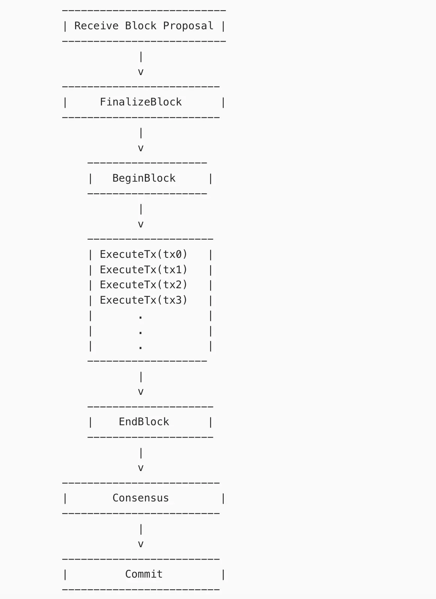

# Cometbft

Repo: git@github.com:cometbft/cometbft.git

Cosmos 的基建L0层，负责区块产生、共识，节点同步，状态更改等工作，类似于cosmos中的状态机

在本地启动测试demo

```shell
cd cometbft && make build
./build/comebft init  --proxy_app=kvstore 
./build/comebft start  --proxy_app=kvstore
```

```shell
I[2024-10-08|09:47:58.316] Timed out                                    module=consensus dur=983.969ms height=580 round=0 step=RoundStepNewHeight
I[2024-10-08|09:47:58.326] Received proposal                            module=consensus proposal="Proposal{580/0 (DC9067B5AB36BBFC18424C0058792B3ABB7804EFA49763F6AA5B0EB310DC85E3:1:002C75B53810, -1) 52F86EAAF274 @ 2024-10-08T09:47:57.312736Z}" proposer=66A1855D8FABB556DCB6CE9C14BB5A351DD01947
I[2024-10-08|09:47:58.330] Received complete proposal block             module=consensus height=580 hash=DC9067B5AB36BBFC18424C0058792B3ABB7804EFA49763F6AA5B0EB310DC85E3
I[2024-10-08|09:47:58.347] Finalizing commit of block                   module=consensus height=580 hash=DC9067B5AB36BBFC18424C0058792B3ABB7804EFA49763F6AA5B0EB310DC85E3 root=0000000000000000 num_txs=0
I[2024-10-08|09:47:58.355] Finalized block                              module=state height=580 num_txs_res=0 num_val_updates=0 block_app_hash=0000000000000000 syncing_to_height=580
I[2024-10-08|09:47:58.360] Committed state                              module=state height=580 block_app_hash=0000000000000000
I[2024-10-08|09:47:58.367] indexed block events                         module=txindex height=580
I[2024-10-08|09:47:59.347] Timed out                                    module=consensus dur=983.917ms height=581 round=0 step=RoundStepNewHeight
I[2024-10-08|09:47:59.358] Received proposal                            module=consensus proposal="Proposal{581/0 (A9125E8DCEF0C76E3D4CBD8CFD6941E719D1734D7AEB3A8619344022DED5B468:1:20D9E06C699E, -1) 8C646614757D @ 2024-10-08T09:47:58.343701Z}" proposer=66A1855D8FABB556DCB6CE9C14BB5A351DD01947
I[2024-10-08|09:47:59.362] Received complete proposal block             module=consensus height=581 hash=A9125E8DCEF0C76E3D4CBD8CFD6941E719D1734D7AEB3A8619344022DED5B468
```

这是本地测试环境中的一段cometbft工作日志，大致分为几个步骤：

1. Received complete proposal block 
2. Finalizing commit of block 
3. Finalized block 
4. Committed state
5. indexed block events

这几个步骤完成了区块产生=====> 状态更改的全部过程，接下来逐个拆解来看这些步骤都做了哪些事情（blocksync，state change... etc）


## Start node service

```shell
State store key layout version               module=main version=vv1
Blockstore version                           module=main version=v1
WARNING: deleting genesis file from database if present, the database stores a hash of the original genesis file now module=main 
service start                                module=proxy msg="Starting multiAppConn service" impl=multiAppConn
service start                                module=abci-client connection=query msg="Starting localClient service" impl=localClient
service start                                module=abci-client connection=snapshot msg="Starting localClient service" impl=localClient
service start                                module=abci-client connection=mempool msg="Starting localClient service" impl=localClient
service start                                module=abci-client connection=consensus msg="Starting localClient service" impl=localClient
service start                                module=events msg="Starting EventBus service" impl=EventBus
service start                                module=pubsub msg="Starting PubSub service" impl=PubSub
service start                                module=txindex msg="Starting IndexerService service" impl=IndexerService

...
service start                                module=main msg="Starting Node service" impl=Node serve 
module=rpc-server msg="Starting RPC HTTP server on 127.0.0.1:26657"
service start                                module=p2p msg="Starting P2P Switch service" impl="P2P Switch"
service start                                module=mempool msg="Starting Mempool service" impl=Mempool
service start                                module=blocksync msg="Starting Reactor service" impl=Reactor
service start                                module=consensus msg="Starting Consensus service" impl=ConsensusReactor
service start                                module=consensus msg="Starting State service" impl=ConsensusState
...
```

以上日志是截取的 是执行 `cometbft start` 之后的部分日志，使用的则是默认的配置，启动的源码路径`cometbft/cmd/cometbft/commands/run_node.go`

```go
func NewNodeWithCliParams(ctx context.Context,
	config *cfg.Config,
	privValidator types.PrivValidator,
	nodeKey *p2p.NodeKey,
	clientCreator proxy.ClientCreator,
	genesisDocProvider GenesisDocProvider,
	dbProvider cfg.DBProvider,
	metricsProvider MetricsProvider,
	logger log.Logger,
	cliParams CliParams,
	options ...Option,
) (*Node, error) {

  // 初始化数据库
  initDBs(config, dbProvider)
  
  // 加载状态/创世文件
  LoadStateFromDBOrGenesisDocProvider(stateDB, genesisDocProvider, genesisHash)
  
  // 性能监控服务 
	metricsProvider(genDoc.ChainID)
  
  // 设置状态存储和区块存储
  stateStore := sm.NewStore(stateDB, sm.StoreOptions{
		DiscardABCIResponses: config.Storage.DiscardABCIResponses,
		Metrics:              smMetrics,
		Compact:              config.Storage.Compact,
		CompactionInterval:   config.Storage.CompactionInterval,
		Logger:               logger,
		DBKeyLayout:          config.Storage.ExperimentalKeyLayout,
	})

	blockStore := store.NewBlockStore(blockStoreDB, store.WithMetrics(bstMetrics), store.WithCompaction(config.Storage.Compact, config.Storage.CompactionInterval), store.WithDBKeyLayout(config.Storage.ExperimentalKeyLayout), store.WithDBKeyLayout(config.Storage.ExperimentalKeyLayout))
	logger.Info("Blockstore version", "version", blockStore.GetVersion())

  // 删除db中的创世文件
  stateDB.Delete(genesisDocKey)
  
  //创建代理应用并建立到ABCI应用的连接。
  createAndStartProxyAppConns(clientCreator, logger, abciMetrics)
  
  //启动event 以及index 服务
  createAndStartEventBus(logger)
  createAndStartIndexerService(config,
		genDoc.ChainID, dbProvider, eventBus, logger)
  
  // 根据配置决定是否进行状态同步
  stateSync := config.StateSync.Enable && !state.Validators.ValidatorBlocksTheChain(localAddr)
	if stateSync && state.LastBlockHeight > 0 {
		logger.Info("Found local state with non-zero height, skipping state sync")
		stateSync = false
	}
  
  // 日志记录组件
  logNodeStartupInfo(state, pubKey, logger, consensusLogger)
  
  // 创建mempool,Evidence组件
  createMempoolAndMempoolReactor(...)
  createEvidenceReactor(...)
  
  // purne 组件
  createPruner(
  ...
  logger.With("module", "state"),
  )
  
  //启动blocksync 以及 consensus statesync 组件
  createBlocksyncReactor(config, state, blockExec, blockStore, blockSync, localAddr, logger, bsMetrics, offlineStateSyncHeight)
  
  createConsensusReactor(
		config, state, blockExec, blockStore, mempool, evidencePool,
		privValidator, csMetrics, waitSync, eventBus, consensusLogger, offlineStateSyncHeight,
	)
  
  statesync.NewReactor(
		*config.StateSync,
		proxyApp.Snapshot(),
		proxyApp.Query(),
		ssMetrics,
	)
  stateSyncReactor.SetLogger(logger.With("module", "statesync"))
  
  // p2p 模块相关的配置
  // 创建网络信息、传输层和交换机。 
  createTransport(config, nodeInfo, nodeKey, proxyApp)
  p2pLogger := logger.With("module", "p2p")
	sw := createSwitch(
		config, transport, p2pMetrics, peerFilters, mempoolReactor, bcReactor,
		stateSyncReactor, consensusReactor, evidenceReactor, nodeInfo, nodeKey, p2pLogger,
	)
  
  sw.AddPersistentPeers(...)
  sw.AddUnconditionalPeerIDs(...)
  createAddrBookAndSetOnSwitch(config, sw, p2pLogger, nodeKey)
  
  // 根据配置确认是否启动 p2pEX
  if config.P2P.PexReactor {
		pexReactor = createPEXReactorAndAddToSwitch(addrBook, config, sw, logger)
	}
}
```

tips：

* DB: cometbft 中提供了 *badgerdb | goleveldb | pebbledb | rocksdb* 多种数据库选择，可以在启动节点时自行配置。
* 监控服务涉及到：
  *   csMetrics, p2pMetrics, memplMetrics, smMetrics, bstMetrics, abciMetrics, bsMetrics, ssMetrics 
* proxyApp 负责建立和管理 CometBFT 核心（共识、内存池和查询组件）与实际应用程序之间的连接。这种交互通过 ABCI 连接进行（ABCI 是共识引擎与处理交易的状态机（应用程序）交互的协议），其中包括：
  * Consensus：用于将交易传递给应用程序并接收响应。
  * mempool：用于在将交易包含在区块之前对其进行验证。
  * query：用于读取应用程序状态。
  * 这种设计将区块链共识层与应用层分开。这种模块化允许开发人员独立于共识引擎编写应用程序逻辑，从而使广泛的应用程序能够利用 CometBFT 的共识引擎，而无需修改共识代码本身。
* IndexerService 负责跟踪和索引区块链数据，特别是交易和区块信息，以便以后可以高效地查询。此服务在通过查询快速访问历史区块链数据（例如特定交易或区块）方面起着至关重要的作用。
* EventBus 充当发布区块链事件的系统（例如，当交易包含在区块中时）。IndexerService 监听这些事件以了解何时提交新交易或区块，以便对其进行索引。

### ProxyAppConns

path: cometbft/proxy/multi_app_conn.go

ProxyAppConns 模块的启动逻辑，启动query/snapshot/mempool/consensus localclient 负责实际应用程序之间的连接。

```go
func (app *multiAppConn) OnStart() error {
	if err := app.startQueryClient(); err != nil {
		return err
	}
	if err := app.startSnapshotClient(); err != nil {
		app.stopAllClients()
		return err
	}
	if err := app.startMempoolClient(); err != nil {
		app.stopAllClients()
		return err
	}
	if err := app.startConsensusClient(); err != nil {
		app.stopAllClients()
		return err
	}

	// Kill CometBFT if the ABCI application crashes.
	go app.killTMOnClientError()

	return nil
}
```

### P2P server

#### P2P reactor

```go
// OnStart implements BaseService.
func (p *peer) OnStart() error {
	if err := p.BaseService.OnStart(); err != nil {
		return err
	}

	if err := p.mconn.Start(); err != nil {
		return err
	}
 //收集和报告与peer网络活动相关的指标
	go p.metricsReporter()
	return nil
}

type BaseReactor struct {
	service.BaseService // Provides Start, Stop, .Quit
	Switch              *Switch
}
// Switch 处理对等连接并公开 API 以接收传入消息，协调多个reactor之间的工作。
type Switch struct {
	service.BaseService

	config        *config.P2PConfig
	reactors      map[string]Reactor
	chDescs       []*conn.ChannelDescriptor
	reactorsByCh  map[byte]Reactor
	msgTypeByChID map[byte]proto.Message
	peers         *PeerSet
	dialing       *cmap.CMap
	reconnecting  *cmap.CMap
	nodeInfo      NodeInfo // our node info
	nodeKey       *NodeKey // our node privkey
	addrBook      AddrBook
	// peers addresses with whom we'll maintain constant connection
	persistentPeersAddrs []*NetAddress
	unconditionalPeerIDs map[ID]struct{}

	transport Transport

	filterTimeout time.Duration
	peerFilters   []PeerFilterFunc

	rng *rand.Rand // seed for randomizing dial times and orders

	metrics *Metrics
}
```

#### BaseService 

在 CometBFT 中，BaseService 是共识、P2P 和内存池等各种模块中使用的基本组件。它提供了一种管理服务生命周期（例如启动、停止和重置服务）的标准方法，同时还确保这些组件之间的状态处理一致。每个模块的职责都围绕其在区块链系统中的特定角色，但 BaseService 统一了它们的生命周期管理。

P2P 模块处理网络中节点之间的通信，包括交易传播、区块提议和状态信息的传播。它确保节点保持连接并可以交换必要的数据以维持共识。
BaseService ：在 P2P 模块中，BaseService 管理网络连接和对等管理过程的生命周期。例如，它控制peer之间连接的初始化和终止。它确保正确启动与对等相关的任务，例如消息广播、对等发现和健康检查。
示例：P2P 层中的 Switch 管理对等连接，使用 BaseService.OnStart() 初始化并启动其反应器和对等体，确保网络正确开始通信。

#### CMonn server

```go
// OnStart implements BaseService.
func (c *MConnection) OnStart() error {
	if err := c.BaseService.OnStart(); err != nil {
		return err
	}
	c.flushTimer = timer.NewThrottleTimer("flush", c.config.FlushThrottle)
	c.pingTimer = time.NewTicker(c.config.PingInterval)
	c.pongTimeoutCh = make(chan bool, 1)
	c.chStatsTimer = time.NewTicker(updateStats)
	c.quitSendRoutine = make(chan struct{})
	c.doneSendRoutine = make(chan struct{})
	c.quitRecvRoutine = make(chan struct{})
	go c.sendRoutine()
	go c.recvRoutine()
	return nil
}
```


##### sendRoutine

是p2p 模块用来监听peer状态，以及发送消息

```go
func (c *MConnection) sendRoutine() {
  ...
  SELECTION:
		select {
		case <-c.flushTimer.Ch:
			// NOTE: flushTimer.Set() must be called every time
			// something is written to .bufConnWriter.
			c.flush()
		case <-c.chStatsTimer.C:
			for _, channel := range c.channels {
				channel.updateStats()
			}
		case <-c.pingTimer.C:
			c.Logger.Debug("Send Ping")
			_n, err = protoWriter.WriteMsg(mustWrapPacket(&tmp2p.PacketPing{}))
			if err != nil {
				c.Logger.Error("Failed to send PacketPing", "err", err)
				break SELECTION
			}
			c.sendMonitor.Update(_n)
			c.Logger.Debug("Starting pong timer", "dur", c.config.PongTimeout)
			c.pongTimer = time.AfterFunc(c.config.PongTimeout, func() {
				select {
				case c.pongTimeoutCh <- true:
				default:
				}
			})
			c.flush()
		case timeout := <-c.pongTimeoutCh:
			if timeout {
				c.Logger.Debug("Pong timeout")
				err = errors.New("pong timeout")
			} else {
				c.stopPongTimer()
			}
		case <-c.pong:
			c.Logger.Debug("Send Pong")
			_n, err = protoWriter.WriteMsg(mustWrapPacket(&tmp2p.PacketPong{}))
			if err != nil {
				c.Logger.Error("Failed to send PacketPong", "err", err)
				break SELECTION
			}
			c.sendMonitor.Update(_n)
			c.flush()
		case <-c.quitSendRoutine:
			break FOR_LOOP
		case <-c.send:
			// Send some PacketMsgs
			eof := c.sendSomePacketMsgs(protoWriter)
			if !eof {
				// Keep sendRoutine awake.
				select {
				case c.send <- struct{}{}:
				default:
				}
			}
		}

		if !c.IsRunning() {
			break FOR_LOOP
		}
		if err != nil {
			c.Logger.Error("Connection failed @ sendRoutine", "conn", c, "err", err)
			c.stopForError(err)
			break FOR_LOOP
		}
  ...
}
```

##### recvRoutine

recvRoutine一个接收消息的例程，用于在一个连接上接收数据包消息，并根据消息类型进行不同的处理

```go
func (c *MConnection) recvRoutine() {
  ...
  FOR_LOOP:
  for {
    c.recvMonitor.Limit(c._maxPacketMsgSize, atomic.LoadInt64(&c.config.RecvRate), true)
    
    ...
    switch pkt := packet.Sum.(type) {
		case *tmp2p.Packet_PacketPing:
      c.Logger.Debug("Receive Ping")
			select {
			case c.pong <- struct{}{}:
			default:
				// never block
			}
      case *tmp2p.Packet_PacketPong:
			c.Logger.Debug("Receive Pong")
			select {
			case c.pongTimeoutCh <- false:
			default:
				// never block
			}
		case *tmp2p.Packet_PacketMsg:
			channelID := byte(pkt.PacketMsg.ChannelID)
			channel, ok := c.channelsIdx[channelID]
			if pkt.PacketMsg.ChannelID < 0 || pkt.PacketMsg.ChannelID > math.MaxUint8 || !ok || channel == nil {
				err := fmt.Errorf("unknown channel %X", pkt.PacketMsg.ChannelID)
				c.Logger.Debug("Connection failed @ recvRoutine", "conn", c, "err", err)
				c.stopForError(err)
				break FOR_LOOP
			}

			msgBytes, err := channel.recvPacketMsg(*pkt.PacketMsg)
			if err != nil {
				if c.IsRunning() {
					c.Logger.Debug("Connection failed @ recvRoutine", "conn", c, "err", err)
					c.stopForError(err)
				}
				break FOR_LOOP
			}
			if msgBytes != nil {
				c.Logger.Debug("Received bytes", "chID", channelID, "msgBytes", msgBytes)
				// NOTE: This means the reactor.Receive runs in the same thread as the p2p recv routine
				c.onReceive(channelID, msgBytes)
			}
		default:
			err := fmt.Errorf("unknown message type %v", reflect.TypeOf(packet))
			c.Logger.Error("Connection failed @ recvRoutine", "conn", c, "err", err)
			c.stopForError(err)
			break FOR_LOOP
		}
  }
  close(c.pong)
}
```

从上述代码中可以看出对于接收到的不同类型的数据，会进行相应的处理。

- 如果是 Ping 数据包，记录日志并发送 Pong 信号。
- 如果是 Pong 数据包，记录日志并发送非超时信号。
- 如果是消息数据包（`PacketMsg`），根据通道 ID 获取对应的通道，然后调用通道的 `recvPacketMsg` 方法接收数据包消息。如果接收过程中出现错误，会停止连接；如果成功接收消息字节，则记录日志并将消息推送到 `onReceive` 交给应用程序进行处理。


#### P2P switch module

```go
func createSwitch(config *cfg.Config,
	transport p2p.Transport,
	p2pMetrics *p2p.Metrics,
	peerFilters []p2p.PeerFilterFunc,
	mempoolReactor p2p.Reactor,
	bcReactor p2p.Reactor,
	stateSyncReactor *statesync.Reactor,
	consensusReactor *cs.Reactor,
	evidenceReactor *evidence.Reactor,
	nodeInfo p2p.NodeInfo,
	nodeKey *p2p.NodeKey,
	p2pLogger log.Logger,
) *p2p.Switch {
	sw := p2p.NewSwitch(
		config.P2P,
		transport,
		p2p.WithMetrics(p2pMetrics),
		p2p.SwitchPeerFilters(peerFilters...),
	)
	sw.SetLogger(p2pLogger)
	if config.Mempool.Type != cfg.MempoolTypeNop {
		sw.AddReactor("MEMPOOL", mempoolReactor)
	}
	sw.AddReactor("BLOCKSYNC", bcReactor)
	sw.AddReactor("CONSENSUS", consensusReactor)
	sw.AddReactor("EVIDENCE", evidenceReactor)
	sw.AddReactor("STATESYNC", stateSyncReactor)

	sw.SetNodeInfo(nodeInfo)
	sw.SetNodeKey(nodeKey)

	p2pLogger.Info("P2P Node ID", "ID", nodeKey.ID(), "file", config.NodeKeyFile())
	return sw
}
```

```go
func (sw *Switch) OnStart() error {
	// Start reactors
	for _, reactor := range sw.reactors {
		err := reactor.Start()
		if err != nil {
			return ErrStart{reactor, err}
		}
	}

	// Start accepting Peers.
	go sw.acceptRoutine()

	return nil
}
```

上述两个方法中，将consensus、mempool、blocksync、statesync、evidence这些模块的核心服务注册到p2p switch中，且在启动时逐个启动这些服务。switch模块管理节点之间的连接，并通过添加不同的reactor来处理各种 P2P 网络相关的任务，如内存池管理、区块同步、共识达成、证据处理和状态同步等。同时，它还设置了日志记录器、节点信息和节点密钥，以便更好地监控和管理 P2P 网络中的节点。


```go
func (sw *Switch) acceptRoutine() {
	for {
		p, err := sw.transport.Accept(peerConfig{
			...
		})
		if err != nil {
			switch err := err.(type) {
			case ErrRejected:
				if err.IsSelf() {
					// Remove the given address from the address book and add to our addresses
					// to avoid dialing in the future.
					addr := err.Addr()
					sw.addrBook.RemoveAddress(&addr)
					sw.addrBook.AddOurAddress(&addr)
				}

				sw.Logger.Info(
					"Inbound Peer rejected",
					"err", err,
					"numPeers", sw.peers.Size(),
				)

				continue
			case ErrFilterTimeout:
				sw.Logger.Error(
					"Peer filter timed out",
					"err", err,
				)

				continue
			case ErrTransportClosed:
				sw.Logger.Error(
					"Stopped accept routine, as transport is closed",
					"numPeers", sw.peers.Size(),
				)
			default:
				sw.Logger.Error(
					"Accept on transport errored",
					"err", err,
					"numPeers", sw.peers.Size(),
				)
				panic(fmt.Sprintf("accept routine exited: %v", err))
			}

			break
		}

    // check peer
		if !sw.IsPeerUnconditional(p.NodeInfo().ID()) {
			// Ignore connection if we already have enough peers.
			_, in, _ := sw.NumPeers()
			if in >= sw.config.MaxNumInboundPeers {
				sw.Logger.Info(
					"Ignoring inbound connection: already have enough inbound peers",
					"address", p.SocketAddr(),
					"have", in,
					"max", sw.config.MaxNumInboundPeers,
				)

				sw.transport.Cleanup(p)

				continue
			}
		}

		if err := sw.addPeer(p); err != nil {
			sw.transport.Cleanup(p)
			if p.IsRunning() {
				_ = p.Stop()
			}
			sw.Logger.Info(
				"Ignoring inbound connection: error while adding peer",
				"err", err,
				"id", p.ID(),
			)
		}
	}
}
```

**不断接受新的对等节点连接，并根据各种条件进行处理，包括错误处理、检查对等节点数量限制和添加对等节点等操作，以确保 P2P 网络中的对等节点连接能够正确建立和管理。**

如果接受连接时出现错误，根据错误类型进行不同的处理：

- 如果是`ErrRejected`错误，并且是自身拒绝连接，从地址簿中移除该地址并添加到本地地址列表，以避免未来再次拨号。然后继续循环尝试接受新连接。
- 如果是`ErrFilterTimeout`错误，记录日志显示对等节点过滤器超时错误，然后继续循环尝试接受新连接。
- 如果是`ErrTransportClosed`错误，记录日志显示停止接受例程，因为传输层已关闭，并记录当前连接数。然后跳出循环。

> ```go
> func (mt *MultiplexTransport) Accept(cfg peerConfig) (Peer, error) {select {
> 	case a := <-mt.acceptc:
> 		if a.err != nil {
> 			return nil, a.err
> 		}
> 
> 		cfg.outbound = false
> 
> 		return mt.wrapPeer(a.conn, a.nodeInfo, cfg, a.netAddr), nil
> 		case <-mt.closec:
> 			return nil, ErrTransportClosed{}
> 	}
> }
> ```
>
> ```go
> func (mt *MultiplexTransport) wrapPeer(
> 	c net.Conn,
> 	ni NodeInfo,
> 	cfg peerConfig,
> 	socketAddr *NetAddress,
> ) Peer {
>   ...
>   p := newPeer(
> 		peerConn,
> 		mt.mConfig,
> 		ni,
> 		cfg.reactorsByCh,
> 		cfg.msgTypeByChID,
> 		cfg.chDescs,
> 		cfg.onPeerError,
> 		PeerMetrics(cfg.metrics),
> 	)
>   return p
> }
> ```
>
> ```go
> func newPeer(
> 	pc peerConn,
> 	mConfig cmtconn.MConnConfig,
> 	nodeInfo NodeInfo,
> 	reactorsByCh map[byte]Reactor,
> 	msgTypeByChID map[byte]proto.Message,
> 	chDescs []*cmtconn.ChannelDescriptor,
> 	onPeerError func(Peer, any),
> 	options ...PeerOption,
> ) *peer {
>   ...
>   p.mconn = createMConnection(
> 		pc.conn,
> 		p,
> 		reactorsByCh,
> 		msgTypeByChID,
> 		chDescs,
> 		onPeerError,
> 		mConfig,
> 	)
> 	p.BaseService = *service.NewBaseService(nil, "Peer", p)
>   ...
> }
> ```
>
> ```go
> func createMConnection(
> 	conn net.Conn,
> 	p *peer,
> 	reactorsByCh map[byte]Reactor,
> 	msgTypeByChID map[byte]proto.Message,
> 	chDescs []*cmtconn.ChannelDescriptor,
> 	onPeerError func(Peer, any),
> 	config cmtconn.MConnConfig,
> ) *cmtconn.MConnection {
>   onReceive := func(chID byte, msgBytes []byte) {
>     reactor := reactorsByCh[chID]
>     ...
>     p.pendingMetrics.AddPendingRecvBytes(getMsgType(msg), len(msgBytes))
> 		reactor.Receive(Envelope{
> 			ChannelID: chID,
> 			Src:       p,
> 			Message:   msg,
> 		})
>   }
>   ...
> }
> ```
>
> 在新建peer时，启动各个raactor的 receive routine。用来处理接受到的消息。


```go
func (sw *Switch) addPeer(p Peer) error {
  sw.filterPeer(p)
  
  ...
  for _, reactor := range sw.reactors {
		p = reactor.InitPeer(p)
	}
  ...
  p.Start()
  ...
  sw.peers.Add(p)
  ...
  
  for _, reactor := range sw.reactors {
		reactor.AddPeer(p)
	}
  ...
}
```

大致就是初始化peer，启动peer 然后每个reactor添加peer


### mempool  service

```go
func createMempoolAndMempoolReactor(
	config *cfg.Config,
	proxyApp proxy.AppConns,
	state sm.State,
	eventBus *types.EventBus,
	waitSync bool,
	memplMetrics *mempl.Metrics,
	logger log.Logger,
	appInfoResponse *abci.InfoResponse,
) (mempl.Mempool, mempoolReactor) {
  ...
  
  mp := mempl.NewCListMempool(
			config.Mempool,
			proxyApp.Mempool(),
			lanesInfo,
			state.LastBlockHeight,
			options...,
		)
		mp.SetLogger(logger)
		reactor := mempl.NewReactor(
			config.Mempool,
			mp,
			waitSync,
		)
  ...
}
```

#### memReactor

```go
type Reactor struct {
	p2p.BaseReactor
	config  *cfg.MempoolConfig
	mempool *CListMempool

	waitSync   atomic.Bool
	waitSyncCh chan struct{} // for signaling when to start receiving and sending txs

	// Semaphores to keep track of how many connections to peers are active for broadcasting
	// transactions. Each semaphore has a capacity that puts an upper bound on the number of
	// connections for different groups of peers.
	activePersistentPeersSemaphore    *semaphore.Weighted
	activeNonPersistentPeersSemaphore *semaphore.Weighted
}
```

Mempool Reactor 处理对等点之间的内存池 tx 广播

#### Recvice

```go
func (memR *Reactor) Receive(e p2p.Envelope) {
	switch msg := e.Message.(type) {
	case *protomem.Txs:
    // 等待节点同步
    if memR.WaitSync() {...}
    // 初步检查消息
    protoTxs := msg.GetTxs()
    if len(protoTxs) == 0 {return error}
    //添加至mempool
    for _, txBytes := range protoTxs {
			_, _ = memR.TryAddTx(types.Tx(txBytes), e.Src)
		}
    
    default:
      memR.Logger.Error("Unknown message type", "src", e.Src, "chId", e.ChannelID, "msg", e.Message)
      memR.Switch.StopPeerForError(e.Src, fmt.Errorf("mempool cannot handle message of type: %T", e.Message))
      return
	}
}
```

##### tryaddtx

```go
func (memR *Reactor) TryAddTx(tx types.Tx, sender p2p.Peer) (*abcicli.ReqRes, error) {
  ...
  memR.mempool.CheckTx(tx, senderID)
  //deal with tx
  ...
}
```

```go
func (mem *CListMempool) CheckTx(tx types.Tx, sender p2p.ID) (*abcicli.ReqRes, error) {
	mem.updateMtx.RLock()
  defer mem.updateMtx.RUnlock()
	
  // txsize check
  mem.isFull(txSize)
  
  if txSize > mem.config.MaxTxBytes {return error}
  
  if mem.preCheck != nil {
    mem.preCheck(tx)
  }
  // 将tx添加至cache
  mem.addToCache(tx);

  // 向代理应用发送异步 CheckTx 请求，请求类型为 CHECK_TX_TYPE_CHECK
  mem.proxyAppConn.CheckTxAsync(context.TODO(), &abci.CheckTxRequest{
        Tx:   tx,
        Type: abci.CHECK_TX_TYPE_CHECK,
    })
  
  //接收proxyapp的响应时进行进一步的处理。
  reqRes.SetCallback(mem.handleCheckTxResponse(tx, sender))
}
```

```go

func (mem *CListMempool) handleCheckTxResponse(tx types.Tx, sender p2p.ID) func(res *abci.Response) error {
  return func(r *abci.Response) error {
    // tx 检查以及错误处理。
    ...
    
    res := r.GetCheckTx()
    ...
    
    if res.Code != abci.CodeTypeOK || postCheckErr != nil {
      mem.tryRemoveFromCache(tx)
    ...
    }
    
    //通道选择和满状态检查
    lane := mem.defaultLane
		if res.LaneId != "" {
			if _, ok := mem.lanes[lane]; !ok {
				panic(ErrLaneNotFound{laneID: lane})
			}
			lane = LaneID(res.LaneId)
		}

		if err := mem.isLaneFull(len(tx), lane); err != nil {
			mem.forceRemoveFromCache(tx) // lane might have space later
			// use debug level to avoid spamming logs when traffic is high
			mem.logger.Debug(err.Error())
			mem.metrics.RejectedTxs.Add(1)
			return err
		}
    // add tx into mempool
    mem.addTx(tx, res.GasWanted, sender, lane)
		mem.notifyTxsAvailable()

    mem.updateSizeMetrics(lane)
  }

	return nil

}
```

```go
func (mem *CListMempool) addTx(tx types.Tx, gasWanted int64, sender p2p.ID, lane LaneID) {
  mem.txsMtx.Lock()
	defer mem.txsMtx.Unlock()

  
  mem.addTxChMtx.Lock()
	defer mem.addTxChMtx.Unlock()
  
  
  // new tx
  memTx := &mempoolTx{
		tx:        tx,
		height:    mem.height.Load(),
		gasWanted: gasWanted,
		lane:      lane,
		seq:       mem.addTxSeq,
	}
  ...
  mem.metrics.TxSizeBytes.Observe(float64(len(tx)))
}
```

>  tip:
>
> Lane 的作用 
>
> 1. 区分交易类型：不同的交易可能具有不同的优先级、处理要求或用途。通过使用不同的通道（lane），可以将交易进行分类，以便在后续的处理过程中进行更有针对性的管理。
>    - 例如，某些关键的交易可以被分配到特定的高优先级通道，以确保它们能够更快地被处理。
> 2. **优化资源分配**：可以根据不同通道的特点，合理分配系统资源。比如，可以为高优先级通道分配更多的处理能力或内存资源，以提高关键交易的处理速度。
> 3. **灵活的策略调整**：如果系统的需求发生变化，可以通过调整不同通道的配置参数，实现灵活的策略调整。例如，可以增加或减少某个通道的容量，或者改变其处理优先级。
>
> ```go
> type lane struct {
> 	id       LaneID
> 	priority LanePriority // 优先级
> }
> ```

#### addpeer

```go
func (memR *Reactor) AddPeer(peer p2p.Peer) {
  // 交易是否允许广播，以及peer 是否有mempoolchannel
  if memR.config.Broadcast && peer.HasChannel(MempoolChannel) {
    go func() {
      
      //... 配置检查...
      if peerSemaphore != nil {
        for peer.IsRunning() {
          // 30 超时
          context.WithTimeout(context.TODO(), 30*time.Second)
          peerSemaphore.Acquire(ctxTimeout, 1)
						cancel()
          ...
        }
      }
      memR.mempool.metrics.ActiveOutboundConnections.Add(1)
			defer memR.mempool.metrics.ActiveOutboundConnections.Add(-1)
			//启动广播交易的例程，将交易转发给对等节点
      memR.broadcastTxRoutine(peer)
    }()
  }
}
```

```go
func (memR *Reactor) broadcastTxRoutine(peer p2p.Peer) {
  ///进行一些常规校验，peer是否活跃，peer的高度、状态是否与当前节点一致，交易是否是从该peer路由过来的
  for{
    
    ...
    txHash := entry.Tx().Hash()
    if entry.IsSender(peer.ID()) {
			memR.Logger.Debug("Skipping transaction, peer is sender",
				"tx", log.NewLazySprintf("%X", txHash), "peer", peer.ID())
			continue
		}
    for {
      if !memR.mempool.Contains(entry.Tx().Key()) {
				break
			}
      
      ...
      success := peer.Send(p2p.Envelope{
				ChannelID: MempoolChannel,
				Message:   &protomem.Txs{Txs: [][]byte{entry.Tx()}},
			})
			if success {
				break
			}
      select {
			case <-time.After(PeerCatchupSleepIntervalMS * time.Millisecond):
			case <-peer.Quit():
				return
			case <-memR.Quit():
				return
			}
    }
  }
}
```

broadcastTxRoutine将内存池中的新交易发送给指定的对等节点。它会考虑节点的同步状态、对等节点的落后情况以及交易的来源等因素，确保交易能够正确地发送给合适的对等节点，并且在发送失败时会进行重试或在必要时停止发送。


### evidence service

```go
func createEvidenceReactor(config *cfg.Config, dbProvider cfg.DBProvider,
	stateStore sm.Store, blockStore *store.BlockStore, logger log.Logger,
 ) (*evidence.Reactor, *evidence.Pool, error) {
  
  // db provider
  evidenceDB, err := dbProvider(&cfg.DBContext{ID: "evidence", Config: config})
  
  evidencePool=evidence.NewPool(config ...)
  evidence.NewReactor(evidencePool)
}
```

```go
// 要广播和提交的有效证据池
type Pool struct {
	logger log.Logger

	evidenceStore dbm.DB
	evidenceList  *clist.CList // concurrent linked-list of evidence
	evidenceSize  uint32       // amount of pending evidence

	// needed to load validators to verify evidence
	stateDB sm.Store
	// needed to load headers and commits to verify evidence
	blockStore BlockStore

	mtx sync.Mutex
	// latest state
	state sm.State
	// evidence from consensus is buffered to this slice, awaiting until the next height
	// before being flushed to the pool. This prevents broadcasting and proposing of
	// evidence before the height with which the evidence happened is finished.
	consensusBuffer []duplicateVoteSet

	pruningHeight int64
	pruningTime   time.Time

	dbKeyLayout KeyLayout
}
```

#### evidenve Reactor

```go
func NewReactor(evpool *Pool) *Reactor {
	evR := &Reactor{
		evpool: evpool,
	}
	evR.BaseReactor = *p2p.NewBaseReactor("Evidence", evR)
	return evR
}

// 处理ev的广播
type Reactor struct {
	p2p.BaseReactor
	evpool   *Pool
	eventBus *types.EventBus
}
```

#### addpeer

```go
func (evR *Reactor) AddPeer(peer p2p.Peer) {
	if peer.HasChannel(EvidenceChannel) {
    // 将ev路由到其他节点
		go evR.broadcastEvidenceRoutine(peer)
	}
}
```

#### Receive

```go
func (evR *Reactor) Receive(e p2p.Envelope) {
  evis, err := evidenceListFromProto(e.Message)
  
  ...
  
  for _, ev := range evis {
    evR.evpool.AddEvidence(ev)
  }
}
```

```go
func (evpool *Pool) AddEvidence(ev types.Evidence) error {
  ... 
  
  // 1) Verify against state.
  evpool.verify(ev)
  
  // 2) Save to store.
  evpool.addPendingEvidence(ev)
  
  // 3) Add evidence to clist.
	evpool.evidenceList.PushBack(ev)
  
  ...
}
```

```go
func (evpool *Pool) verify(evidence types.Evidence) error {
  
  // 验证ev时间
  evTime := blockMeta.Header.Time
  if evidence.Time() != evTime {
    return error
  }
  // 检查evidence是否过期，使用块证据时间和高度计算
  if IsEvidenceExpired(height, state.LastBlockTime, evidence.Height(), evTime, evidenceParams) {
    return error
  }
  
  //处理不同类型的 evidence
  switch ev := evidence.(type) {
    case *types.DuplicateVoteEvidence:
    	return VerifyDuplicateVote(ev, state.ChainID, valSet)
    	
    case *types.LightClientAttackEvidence:
    	...
    	VerifyLightClientAttack(ev, commonHeader, trustedHeader, commonVals)
    	
  default:
    return ErrUnrecognizedEvidenceType{Evidence: evidence}
  }
}
```

* `VerifyDuplicateVote`  主要验证重复投票证据，包括验证者在特定高度是否在验证者集合中、两个投票的高度、轮次、类型、地址一致性，区块 ID 不同性，公钥与地址匹配性，投票权一致性以及两个投票的签名有效性。
* `VerifyLightClientAttack`:主要用于验证轻客户端攻击证据,
  * 检查全节点的公共头部（`commonHeader`）至少有 1/3 的投票权也存在于冲突头部（`conflicting header`）的提交中。
  * 确认冲突验证者集合中 2/3 以上的验证者正确签署了冲突区块。
  * 验证节点的可信头部（`trustedHeader`）与冲突头部在同一高度时具有不同的哈希值。
  * 检查所有签名，因为这将作为证据使用。
* 辅助函数`validateABCIEvidence`用于验证轻客户端攻击证据的 ABCI 组件，包括投票权和拜占庭验证者，确保总投票权一致，并验证证据中列出的拜占庭验证者与实际计算出的一致。

### BlockSync service

```go
type Reactor struct {
	p2p.BaseReactor

	// immutable
	initialState sm.State

	blockExec     *sm.BlockExecutor
	store         sm.BlockStore
	pool          *BlockPool
	blockSync     bool
	localAddr     crypto.Address
	poolRoutineWg sync.WaitGroup

	requestsCh <-chan BlockRequest
	errorsCh   <-chan peerError

	switchToConsensusMs int

	metrics *Metrics
}
```

```go
func (bcR *Reactor) OnStart() error {
	if bcR.blockSync {
		err := bcR.pool.Start()
		if err != nil {
			return err
		}
		bcR.poolRoutineWg.Add(1)
		go func() {
			defer bcR.poolRoutineWg.Done()
			bcR.poolRoutine(false)
		}()
	}
	return nil
}
```

#### Blockpool service

```go
func (pool *BlockPool) OnStart() error {
	pool.startTime = time.Now()
	go pool.makeRequestersRoutine()
	return nil
}
```

```go
func (pool *BlockPool) makeRequestersRoutine() {
  for {
    ... state check...
    pool.mtx.Lock()
    var (
			maxRequestersCreated = len(pool.requesters) >= len(pool.peers)*maxPendingRequestsPerPeer

			nextHeight           = pool.height + int64(len(pool.requesters))
			maxPeerHeightReached = nextHeight > pool.maxPeerHeight
		)
		pool.mtx.Unlock()

		switch {
		case maxRequestersCreated: // If we have enough requesters, wait for them to finish.
			time.Sleep(requestInterval)
			pool.removeTimedoutPeers()
		case maxPeerHeightReached: // If we're caught up, wait for a bit so reactor could finish or a higher height is reported.
			time.Sleep(requestInterval)
		default:
			pool.makeNextRequester(nextHeight)
			// Sleep for a bit to make the requests more ordered.
			time.Sleep(requestInterval)
		}
  }
}
```

> * maxRequestersCreated判断是否已经创建了足够的请求者，即已有的请求者数量是否大于等于对等节点数量乘以每个对等节点的最大挂起请求数。
> * nextHeight计算下一个请求的区块高度，即当前区块池的高度加上已有的请求者数量
> * maxPeerHeightReached判断是否已经达到了最大对等节点的高度，即下一个请求的高度是否大于区块池记录的最大对等节点高度。
>
> 总结： makeRequestersRoutine在区块池中创建和管理请求者，以从对等节点获取区块。它会根据不同的情况进行等待、创建请求者或移除超时的对等节点等操作，以确保区块池能够高效地获取和处理区块。


#### block poolRoutine

```go
func (bcR *Reactor) poolRoutine(stateSynced bool) {
  ... do something for init  this service
  
  go bcR.handleBlockRequestsRoutine()
  
  ... 
  FOR_LOOP:
	for {
		select {
      //处理切换到共识的定时器事件
		case <-switchToConsensusTicker.C:
      // 初始提交没有扩展且当前状态缺少扩展，则继续循环等待
      if !initialCommitHasExtensions {
				if bcR.isMissingExtension(state, blocksSynced) {
					continue FOR_LOOP
				}
			}
			// 同步完成
			if bcR.isCaughtUp(state, blocksSynced, stateSynced) {
				break FOR_LOOP
			}
      
      
    case <-trySyncTicker.C: // chan time
			select {
			case didProcessCh <- struct{}{}:
			default:
			}

		case <-didProcessCh:
    	... do some state check...
      // 处理同步过来的区块
      bcR.processBlock(first, second, firstParts, state, extCommit)
      
      blocksSynced++
      
      // 每同步100个区块，则记录一次
      if blocksSynced%100 == 0 {
				_, height, maxPeerHeight := bcR.pool.IsCaughtUp()
				lastRate = 0.9*lastRate + 0.1*(100/time.Since(lastHundred).Seconds())
				bcR.Logger.Info("Block Sync Rate", "height", height, "max_peer_height", maxPeerHeight, "blocks/s", lastRate)
				lastHundred = time.Now()
			}

			continue FOR_LOOP
  
    case <-bcR.Quit():
			break FOR_LOOP
		case <-bcR.pool.Quit():
			break FOR_LOOP
    }
  }
      
}
```

```go
func (bcR *Reactor) processBlock(first, second *types.Block, firstParts *types.PartSet, state sm.State, extCommit *types.ExtendedCommit) (sm.State, error) {
  ... do something for init values
  // verify firstblock by second.commit
  // 进行区块签名等基础信息的验证。
  err := state.Validators.VerifyCommitLight(
		chainID, firstID, first.Height, second.LastCommit)

	if err == nil {
		// validate the block before we persist it
		err = bcR.blockExec.ValidateBlock(state, first)
	}
  
  //检查是否需要扩展提交以及扩展提交是否存在 
  presentExtCommit := extCommit != nil
	extensionsEnabled := state.ConsensusParams.Feature.VoteExtensionsEnabled(first.Height)
  if presentExtCommit != extensionsEnabled {
    err = fmt.Errorf("non-nil extended commit must be received iff vote extensions are enabled for its height "+
			"(height %d, non-nil extended commit %t, extensions enabled %t)",
			first.Height, presentExtCommit, extensionsEnabled,
		)
  }
  if err == nil && extensionsEnabled {
		// if vote extensions were required at this height, ensure they exist.
		err = extCommit.EnsureExtensions(true)
	}
  
  //如果验证失败，从区块池中移除与该区块高度相关的对等节点并重新发起所有对等节点的请求。
  //如果找到对应的对等节点，则停止该对等节点并记录错误。
  if err!=nil{
    
    RemovePeerAndRedoAllPeerRequests(first.Height)
    StopPeerForError(peer, ErrReactorValidation{Err: err})
    bcR.Switch.StopPeerForError(peer2, ErrReactorValidation{Err: err})
  }
  
  //success
  bcR.pool.PopRequest()
  
  //store block  extensionsEnabled or unextensionsEnabled
  if extensionsEnabled {
		bcR.store.SaveBlockWithExtendedCommit(first, firstParts, extCommit)
	} else {
  	bcR.store.SaveBlock(first, firstParts, second.LastCommit)
  }
  bcR.blockExec.ApplyVerifiedBlock(state, firstID, first, bcR.pool.MaxPeerHeight())
 	... 
}
```

```go
func (blockExec *BlockExecutor) applyBlock(state State, blockID types.BlockID, block *types.Block, syncingToHeight int64) (State, error) {
  //用户端定义的finalizeBlock 逻辑，属于ABCI++ 接口的一部分。 
  abciResponse, err := blockExec.proxyApp.FinalizeBlock(args...)
  
  // 在commit之前存储执行的结果
  blockExec.store.SaveFinalizeBlockResponse(...)
  
  //验证以及处理验证者更新
  validateValidatorUpdates(abciResponse.ValidatorUpdates, state.ConsensusParams.Validator)
  
  // 更新状态
  state, err = updateState(state, blockID, &block.Header, abciResponse, validatorUpdates)
  
  //提交应用状态并更新内存池
  blockExec.Commit(state, block, abciResponse)
  
  //更新evpool
  blockExec.evpool.Update(state, block.Evidence.Evidence)
  
  //更新并存储app state
  blockExec.store.Save(state)
  
  //根据请求修剪旧高度
  blockExec.pruner.SetApplicationBlockRetainHeight(retainHeight)
  
  //触发事件
  fireEvents(agrs...)
}
```

> applyBlock 一个区块应用到当前状态，包括与代理应用交互、验证和处理响应、更新状态、提交应用状态、更新证据池、保存状态和触发事件等一系列操作，以确保区块链系统的状态能够正确地随着新的区块而更新。

#### addpeer

```go
// AddPeer implements Reactor by sending our state to peer.
func (bcR *Reactor) AddPeer(peer p2p.Peer) {
	peer.Send(p2p.Envelope{
		ChannelID: BlocksyncChannel,
		Message: &bcproto.StatusResponse{
			Base:   bcR.store.Base(),
			Height: bcR.store.Height(),
		},
	})
	// it's OK if send fails. will try later in poolRoutine

	// peer is added to the pool once we receive the first
	// bcStatusResponseMessage from the peer and call pool.SetPeerRange
}
```

#### Receive

```go
func (bcR *Reactor) Receive(e p2p.Envelope) {
  ValidateMsg(e.Message)
  // 根据消息类型，进行对应的处理
  switch msg := e.Message.(type) {
    // peer 请求区块
	case *bcproto.BlockRequest:
		bcR.respondToPeer(msg, e.Src)
    // 向peer 索求区块
	case *bcproto.BlockResponse:
		go bcR.handlePeerResponse(msg, e.Src)
    // 状态查询
	case *bcproto.StatusRequest:
		// Send peer our state.
		e.Src.TrySend(p2p.Envelope{
			ChannelID: BlocksyncChannel,
			Message: &bcproto.StatusResponse{
				Height: bcR.store.Height(),
				Base:   bcR.store.Base(),
			},
		})
    // 获取peer的状态
	case *bcproto.StatusResponse:
		// Got a peer status. Unverified.
		bcR.pool.SetPeerRange(e.Src.ID(), msg.Base, msg.Height)
	case *bcproto.NoBlockResponse:
		bcR.Logger.Debug("Peer does not have requested block", "peer", e.Src, "height", msg.Height)
		bcR.pool.RedoRequestFrom(msg.Height, e.Src.ID())
	default:
		bcR.Logger.Error(fmt.Sprintf("Unknown message type %v", reflect.TypeOf(msg)))
	}
}
```

处理来了peer的请求包括获取区块信息、状态信息等。

### Consensus Service

```go
// Reactor defines a reactor for the consensus service.
type Reactor struct {
	p2p.BaseReactor // BaseService + p2p.Switch

	conS *State

	waitSync atomic.Bool
	eventBus *types.EventBus

	rsMtx         cmtsync.RWMutex
	rs            *cstypes.RoundState
	initialHeight int64 // under rsMtx

	Metrics *Metrics
}
```

```go
func (conR *Reactor) OnStart() error {
	if conR.WaitSync() {
		conR.Logger.Info("Starting reactor in sync mode: consensus protocols will start once sync completes")
	}
	// start routine that computes peer statistics for evaluating peer quality
	go conR.peerStatsRoutine()

	conR.subscribeToBroadcastEvents()
	go conR.updateRoundStateRoutine()

	if !conR.WaitSync() {
		err := conR.conS.Start() // consensus state server start
		if err != nil {
			return err
		}
	}

	return nil
}
```

```go
func (conR *Reactor) peerStatsRoutine() {
  ...
  
  select {
		case msg := <-conR.conS.statsMsgQueue:
    	//get peer && peer state
    	conR.Switch.Peers().Get(msg.PeerID)
    	peer.Get(types.PeerStateKey).(*PeerState)
    	// deal with recv msgs
    	switch msg.Msg.(type) {
			case *VoteMessage:
				if numVotes := ps.RecordVote(); numVotes%votesToContributeToBecomeGoodPeer == 0 {
					conR.Switch.MarkPeerAsGood(peer)
				}
			case *BlockPartMessage:
				if numParts := ps.RecordBlockPart(); numParts%blocksToContributeToBecomeGoodPeer == 0 {
					conR.Switch.MarkPeerAsGood(peer)
				}
			}
    
    case <-conR.conS.Quit():
			return

		case <-conR.Quit():
			return
}
```

> peerStatsRoutine处理peer的统计信息
>
> - 如果是投票消息，调用对peer状态的`RecordVote`方法记录投票，并检查记录的投票数量是否满足一定条件（达到`votesToContributeToBecomeGoodPeer`的整数倍）。如果满足条件，则调用反应器的`Switch`的`MarkPeerAsGood`方法将该对等节点标记为良好的对等节点。
> - 如果是区块部分消息，类似地调用`RecordBlockPart`方法记录区块部分，并进行相应的检查和标记操作。

```go
func (conR *Reactor) subscribeToBroadcastEvents() {
	const subscriber = "consensus-reactor"
  if err := conR.conS.evsw.AddListenerForEvent(subscriber, types.EventNewRoundStep,
		func(data cmtevents.EventData) {
			conR.broadcastNewRoundStepMessage(data.(*cstypes.RoundState))
			conR.updateRoundStateNoCsLock()
		}); err != nil {
		conR.Logger.Error("Error adding listener for events (NewRoundStep)", "err", err)
	}
  ... etc events
}
```

>  订阅特定的事件，并在事件发生时执行相应的操作
>
> 分别订阅以下事件：
>
> - `types.EventNewRoundStep`（新轮次步骤事件）：当该事件发生时，调用`conR.broadcastNewRoundStepMessage`方法广播新轮次步骤消息，并调用`conR.updateRoundStateNoCsLock`方法更新轮次状态（不使用共识状态锁）。如果订阅过程中出现错误，则记录错误日志。
> - `types.EventValidBlock`（有效区块事件）：当该事件发生时，调用`conR.broadcastNewValidBlockMessage`方法广播新有效区块消息。如果订阅过程中出现错误，则记录错误日志。
> - `types.EventVote`（投票事件）：当该事件发生时，调用`conR.broadcastHasVoteMessage`方法广播有投票消息，并调用`conR.updateRoundStateNoCsLock`方法更新轮次状态。如果订阅过程中出现错误，则记录错误日志。
> - `types.EventProposalBlockPart`（提案区块部分事件）：当该事件发生时，调用`conR.broadcastHasProposalBlockPartMessage`方法广播有提案区块部分消息，并调用`conR.updateRoundStateNoCsLock`方法更新轮次状态。如果订阅过程中出现错误，则记录错误日志。
>
> 总的来说，这个方法的主要作用是通过订阅特定的事件，在事件发生时执行相应的广播消息和更新轮次状态等操作，以实现共识过程中的事件响应和信息传播。

```go
func (conR *Reactor) updateRoundStateRoutine() {
	t := time.NewTicker(100 * time.Microsecond)
	defer t.Stop()
	for range t.C {
		if !conR.IsRunning() {
			return
		}
		rs := conR.conS.GetRoundState()
		conR.rsMtx.Lock()
		conR.rs = rs
		conR.rsMtx.Unlock()
	}
}
```

> 通过定时器定期获取并更新反应器中的共识轮次状态，以确保reactor能够及时反映共识的变化情况。


### consensus state

```go
func (cs *State) OnStart() error {
  //load WAL
  cs.loadWalFile()
  
  // 启动定时器
  cs.timeoutTicker.Start()
  
  // WAL 追赶和修复（如果需要）
  if cs.doWALCatchup {
		repairAttempted := false
    LOOP:
    for {
      err := cs.catchupReplay(cs.Height)
			switch {
			case err == nil:
				break LOOP

			case !IsDataCorruptionError(err):
				cs.Logger.Error("Error on catchup replay; proceeding to start state anyway", "err", err)
				break LOOP

			case repairAttempted:
				return err
			}
      // WAL 文件损坏
      cs.wal.Stop()
      
      //backup wal file
      cmtos.CopyFile(cs.config.WalFile(), corruptedFile)
      
      //repair wal file
      repairWalFile(corruptedFile, cs.config.WalFile())
      
      // reload file
      cs.loadWalFile()
    }
  }
   // 启动s事件交换机，用于处理事件的发布和订阅。
   cs.evsw.Start()
  // 检查在当前高度是否存在双重签名风险。
   cs.checkDoubleSigningRisk(cs.Height)
    
   go cs.receiveRoutine(0)
    
   cs.scheduleRound0(cs.GetRoundState())
	return nil
}
```

> 在启动时加载最新的状态，处理 WAL 文件的追赶和修复，启动相关的定时器和事件交换机，检查双重签名风险，并启动接收例程和安排第一轮，以确保共识状态能够正确地初始化和启动。

#### receiveRoutine

处理各种状态转换的消息（proposals, block parts, votes），以及超时消息的处理。

```go
func (cs *State) receiveRoutine(maxSteps int) {
  for{
    select {
		case <-cs.txNotifier.TxsAvailable():
			cs.handleTxsAvailable()
		
    // 来自peer的消息
		case mi = <-cs.peerMsgQueue:
			if err := cs.wal.Write(mi); err != nil {
				cs.Logger.Error("Failed writing to WAL", "err", err)
			}
			// handles proposals, block parts, votes
			// may generate internal events (votes, complete proposals, 2/3 majorities)
			cs.handleMsg(mi)

    // 节点内部产生的消息
		case mi = <-cs.internalMsgQueue:
			err := cs.wal.WriteSync(mi)
			if err != nil {
				panic(fmt.Sprintf(
					"failed to write %v msg to consensus WAL due to %v; check your file system and restart the node",
					mi, err,
				))
			}

			if _, ok := mi.Msg.(*VoteMessage); ok {
				fail.Fail() // XXX
			}

			// handles proposals, block parts, votes
			cs.handleMsg(mi)
		
    //超时处理
		case ti := <-cs.timeoutTicker.Chan(): // tockChan:
			if err := cs.wal.Write(ti); err != nil {
				cs.Logger.Error("failed writing to WAL", "err", err)
			}

			// if the timeout is relevant to the rs
			// go to the next step
			cs.handleTimeout(ti, rs)

		case <-cs.Quit():
			onExit(cs)
			return
		}
	}
}
```

`cs.txNotifier.TxsAvailable()`

这个分支主要是处理新接收到的、需要被处理以纳入区块链中的交易

```go
func (cs *State) handleTxsAvailable() {
  ... do some check...
  switch cs.Step {
	case cstypes.RoundStepNewHeight: // timeoutCommit phase
		if cs.needProofBlock(cs.Height) {
			// enterPropose will be called by enterNewRound
			return
		}

		// +1ms to ensure RoundStepNewRound timeout always happens after RoundStepNewHeight
		timeoutCommit := cs.StartTime.Sub(cmttime.Now()) + 1*time.Millisecond
		cs.scheduleTimeout(timeoutCommit, cs.Height, 0, cstypes.RoundStepNewRound)

	case cstypes.RoundStepNewRound: // after timeoutCommit
		cs.enterPropose(cs.Height, 0)
}
```

`case mi = <-cs.internalMsgQueue: case mi = <-cs.peerMsgQueue:` 这两个分支主要是处理内部/外部的消息，核心方法是`handleMsg`

```go
func (cs *State) handleMsg(mi msgInfo) {
  ... do some works
  
  switch msg := msg.(type) {
	case *ProposalMessage:
    // setproposal
		err = cs.setProposal(msg.Proposal, mi.ReceiveTime)
    
  case *BlockPartMessage:
    // if the proposal is complete, we'll enterPrevote or tryFinalizeCommit
    added, err = cs.addProposalBlockPart(msg, peerID)
    if added && cs.ProposalBlockParts.IsComplete() {
			cs.handleCompleteProposal(msg.Height)
		}
		if added {
			cs.statsMsgQueue <- mi
		}
	case *VoteMessage:
    added, err = cs.tryAddVote(msg.Vote, peerID)
		if added {
			cs.statsMsgQueue <- mi
		}    
}
```

```go
// node 产生区块时发出该消息
type BlockPartMessage struct {
	Height int64
	Round  int32
	Part   *types.Part
}

// 用于验证和处理接收到的提案，确保提案的合法性和正确性。通过严格的验证和设置操作，可以保证系统的安全性和稳定
//性，防止无效或恶意的提案被接受。同时，记录日志信息有助于调试和监控系统的运行状态
func (cs *State) defaultSetProposal(proposal *types.Proposal, recvTime time.Time) error {
  if cs.Proposal != nil || proposal == nil {
		return nil
	}
  
  ...
  
  // Verify POLRound, which must be -1 or in range [0, proposal.Round).
	if proposal.POLRound < -1 ||
		(proposal.POLRound >= 0 && proposal.POLRound >= proposal.Round) {
		return ErrInvalidProposalPOLRound
	}
  
  // verify signature
  if !proposer.PubKey.VerifySignature(
		types.ProposalSignBytes(cs.state.ChainID, p), proposal.Signature,
	) {
		return ErrInvalidProposalSignature
	}
  // Validate the proposed block size, derived from its PartSetHeader
  maxBytes := cs.state.ConsensusParams.Block.MaxBytes
	if maxBytes == -1 {
		maxBytes = int64(types.MaxBlockSizeBytes)
	}
	if int64(proposal.BlockID.PartSetHeader.Total) > (maxBytes-1)/int64(types.BlockPartSizeBytes)+1 {
		return ErrProposalTooManyParts
	}
  
  if cs.ProposalBlockParts == nil {
		cs.ProposalBlockParts = types.NewPartSetFromHeader(proposal.BlockID.PartSetHeader)

		// If we signed this Proposal, lock the PartSet until we load
		// all the BlockParts that should come just after the Proposal.
		if bytes.Equal(proposer.Address, cs.privValidatorPubKey.Address()) {
			cs.ProposalBlockParts.Lock()
		}
	}
  
  return nil
}
```

```go
func (cs *State) handleCompleteProposal(blockHeight int64) {
  ... do some init works
  
  if cs.Step <= cstypes.RoundStepPropose && cs.isProposalComplete() {
		// Move onto the next step
		cs.enterPrevote(blockHeight, cs.Round)
		if hasTwoThirds { // this is optimisation as this will be triggered when prevote is added
			cs.enterPrecommit(blockHeight, cs.Round)
		}
	} else if cs.Step == cstypes.RoundStepCommit {
		// If we're waiting on the proposal block...
		cs.tryFinalizeCommit(blockHeight)
	}
}
```

`enterPrevote`确保在正确的时机进入预投票步骤，并执行预投票操作。通过合理地管理预投票步骤，可以提高共识的效率和准确性，确保节点能够正确地表达对提案的意见。同时，等待三分之二多数预投票的机制有助于增强共识的稳定性和可靠性。

```go
func (cs *State) enterPrevote(height int64, round int32) {
  
  defer func() {
		// prevote结算完成，进入下一个阶段
		cs.updateRoundStep(round, cstypes.RoundStepPrevote)
		cs.newStep()
	}()
  
  // Sign and broadcast vote as necessary
  cs.doPrevote(height, round) ======> func (cs *State) defaultDoPrevote(height int64, round int32) {}
}
```

```go
func (cs *State) enterPrecommit(height int64, round int32) {
  defer func() {
		// Done enterPrecommit:
		cs.updateRoundStep(round, cstypes.RoundStepPrecommit)
		cs.newStep()
	}()
  
  // check for a polka provotes > 2/3 + 
	blockID, ok := cs.Votes.Prevotes(round).TwoThirdsMajority()
  
  // 2/3+ votes
  if err := cs.eventBus.PublishEventPolka(cs.RoundStateEvent()); err != nil {
		logger.Error("Failed publishing polka", "err", err)
	}
  
  //latest POLRound in this round
  polRound, _ := cs.Votes.POLInfo()
	if polRound < round {
		panic(fmt.Sprintf("this POLRound should be %v but got %v", round, polRound))
	}
  
  //if locked on that block precommit it and update lockround
  if cs.LockedBlock.HashesTo(blockID.Hash) {
		logger.Debug("Precommit step; +2/3 prevoted locked block; relocking")
		cs.LockedRound = round

		if err := cs.eventBus.PublishEventRelock(cs.RoundStateEvent()); err != nil {
			logger.Error("Precommit step; failed publishing event relock", "err", err)
		}

		cs.signAddVote(types.PrecommitType, blockID.Hash, blockID.PartSetHeader, cs.LockedBlock)
		return
	}
  
  // If greater than 2/3 of the voting power on the network prevoted for
the proposed block, update our locked block to this block and issue a precommit vote for it.
  if cs.ProposalBlock.HashesTo(blockID.Hash) {
    cs.blockExec.ValidateBlock
    cs.eventBus.PublishEventLock(cs.RoundStateEvent())
    cs.signAddVote(types.PrecommitType, blockID.Hash, blockID.PartSetHeader, cs.ProposalBlock)
		return
  }
  
  //There was a polka in this round for a block we don't have.
	// Fetch that block, and precommit nil.
  if !cs.ProposalBlockParts.HasHeader(blockID.PartSetHeader) {
		cs.ProposalBlock = nil
		cs.ProposalBlockParts = types.NewPartSetFromHeader(blockID.PartSetHeader)
	}

	cs.signAddVote(types.PrecommitType, nil, types.PartSetHeader{}, nil)
  
}
```

`enterPrecommit`确保节点根据多数预投票的结果进行正确的操作，从而保证共识的准确性和稳定性。通过严格的条件判断和状态更新，有助于防止不一致的预提交行为，并促进区块链网络的一致性。

```go
func (cs *State) tryFinalizeCommit(height int64) {
  // 2/3+ precommit
  blockID, ok := cs.Votes.Precommits(cs.CommitRound).TwoThirdsMajority()
	if !ok || blockID.IsNil() {
		logger.Error("Failed attempt to finalize commit; there was no +2/3 majority or +2/3 was for nil")
		return
	}
  
  cs.finalizeCommit(height)
  
}
// 执行实际的提交操作，包括验证区块、保存区块到存储中、更新状态、执行和提交区块、更新指标等操作。
func (cs *State) finalizeCommit(height int64) {
  // precommit 2/3+
  cs.Votes.Precommits(cs.CommitRound).TwoThirdsMajority()
  
  // check blockheader 
  if !blockParts.HasHeader(blockID.PartSetHeader) {panic}
  
  // check blockhash
  if !block.HashesTo(blockID.Hash) {panic}
  
  //validateBlock
  cs.blockExec.ValidateBlock(cs.state, block)
	
  // Save to blockStore.
  if cs.blockStore.Height() < block.Height {
		// NOTE: the seenCommit is local justification to commit this block,
		// but may differ from the LastCommit included in the next block
		seenExtendedCommit := cs.Votes.Precommits(cs.CommitRound).MakeExtendedCommit(cs.state.ConsensusParams.Feature)
		if cs.state.ConsensusParams.Feature.VoteExtensionsEnabled(block.Height) {
			cs.blockStore.SaveBlockWithExtendedCommit(block, blockParts, seenExtendedCommit)
		} else {
			cs.blockStore.SaveBlock(block, blockParts, seenExtendedCommit.ToCommit())
		}
	}
  ... doe somethings
  stateCopy := cs.state.Copy()
  
  //Execute and commit the block, update and save the state, and update the mempool.
  stateCopy, err := cs.blockExec.ApplyVerifiedBlock(
		stateCopy,
		types.BlockID{
			Hash:          block.Hash(),
			PartSetHeader: blockParts.Header(),
		},
		block,
		block.Height,
	)
  cs.recordMetrics(height, block)
  
  // new heightStep
  cs.updateToState(stateCopy)
  
  // cs.StartTime is already set.
	// Schedule Round0 to start soon.
  // 安排下一轮：安排下一轮的开始时间，进入新的高度步骤。
	cs.scheduleRound0(&cs.RoundState)
  
}
```

`finalizeCommit`在满足条件时正确地完成对区块的提交，更新系统状态，并为下一轮的共识做好准备。通过严格的验证和状态更新，保证了区块链的一致性和稳定性。同时，记录日志和触发 panic 的机制有助于在出现问题时进行调试和错误处理。

case *VoteMessage:

```go
tryAddVote =====> addvote 
func (cs *State) addVote(vote *types.Vote, peerID p2p.ID) (added bool, err error) {
  
  //处理上一个高度的precommit vote
  if vote.Height+1 == cs.Height && vote.Type == types.PrecommitType {
  	added, err = cs.LastCommit.AddVote(vote)
    ...
    cs.evsw.FireEvent(types.EventVote, vote)
		
    // 检查是否可以跳过超时提交
    skipTimeoutCommit := cs.state.NextBlockDelay == 0 && cs.config.TimeoutCommit == 0 //nolint:staticcheck
		if skipTimeoutCommit && cs.LastCommit.HasAll() {
			// go straight to new round (skip timeout commit)
			// cs.scheduleTimeout(time.Duration(0), cs.Height, 0, cstypes.RoundStepNewHeight)
			cs.enterNewRound(cs.Height, 0)
		}
    
    return added,nil
    
  }
  
  ...
  
  // deal extend votes.
  // 如果启用了投票扩展，对于预提交投票且不是针对空块的投票，验证扩展签名。如果投票扩展未启用且投票包含扩展，则拒绝投票。
  extEnabled := cs.state.ConsensusParams.Feature.VoteExtensionsEnabled(vote.Height)
	if extEnabled {
  	if vote.Type == types.PrecommitType && !vote.BlockID.IsNil() &&
			!bytes.Equal(vote.ValidatorAddress, myAddr) {
        ...
      	vote.VerifyExtension(cs.state.ChainID, val.PubKey)
        cs.blockExec.VerifyVoteExtension(context.TODO(), vote)
        cs.metrics.MarkVoteExtensionReceived(err == nil)
      }else if len(vote.Extension) > 0 || len(vote.ExtensionSignature) > 0 {
        return error
      }
    
  }
  
  //添加投票并处理不同类型的投票
  cs.Votes.AddVote(vote, peerID, extEnabled)
  
  
  cs.eventBus.PublishEventVote(types.EventDataVote{Vote: vote})
  cs.evsw.FireEvent(types.EventVote, vote)
  
  switch vote.Type {
	case types.PrevoteType:
  	
    //检查是否有2/3+ 的非空区块投票。
    if blockID, ok := prevotes.TwoThirdsMajority(); ok && !blockID.IsNil() {
      
      ...
      cs.evsw.FireEvent(types.EventValidBlock, &cs.RoundState)
      ...
      cs.eventBus.PublishEventValidBlock(cs.RoundStateEvent())
    }
   	// If +2/3 prevotes for *anything* for future round:
    switch{
      case cs.Round < vote.Round && prevotes.HasTwoThirdsAny():
      	cs.enterNewRound(height, vote.Round)
      case cs.Round == vote.Round && cstypes.RoundStepPrevote <= cs.Step://current count
      	blockID, ok := prevotes.TwoThirdsMajority()
			if ok && (cs.isProposalComplete() || blockID.IsNil()) {
				cs.enterPrecommit(height, vote.Round)
			} else if prevotes.HasTwoThirdsAny() {
				cs.enterPrevoteWait(height, vote.Round)
			}
      case cs.Proposal != nil && 0 <= cs.Proposal.POLRound && cs.Proposal.POLRound == vote.Round:
			// If the proposal is now complete, enter prevote of cs.Round.
			if cs.isProposalComplete() {
				cs.enterPrevote(height, cs.Round)
			}
    }
    
    case types.PrecommitType:
    	blockID, ok := precommits.TwoThirdsMajority()
    	if ok {
      	cs.enterNewRound(height, vote.Round)
				cs.enterPrecommit(height, vote.Round)
        
        if !blockID.IsNil() {
        	cs.enterCommit(height, vote.Round)
          if skipTimeoutCommit && precommits.HasAll() {
					cs.enterNewRound(cs.Height, 0)
          }else{
            cs.enterPrecommitWait(height, vote.Round)
          }
        }else if cs.Round <= vote.Round && precommits.HasTwoThirdsAny(){
          cs.enterNewRound(height, vote.Round)
					cs.enterPrecommitWait(height, vote.Round)
        }
        
    	}
  }
 return added, err
  
}
```

> **PrevoteType**
>
> 1. 检查预投票集合中是否有超过 2/3 的投票权对非空块进行了投票：
>    - 如果是，并且当前投票轮次与当前状态的轮次相同且当前状态的有效轮次小于当前投票轮次，那么根据提案块是否与投票的块哈希匹配来更新有效块信息。如果不匹配，则将提案块设置为`nil`，并根据投票的块部分集头部创建新的块部分集。触发有效块事件并发布有效块事件。
> 2. 根据不同情况进行状态转换：
>    - 如果当前状态的轮次小于投票轮次且预投票集合中有未来轮次的 2/3 多数投票，则进入新的一轮并设置新的轮次为投票轮次。
>    - 如果当前状态的轮次与投票轮次相同且当前状态处于预投票阶段或之前，则根据预投票集合中是否有多数投票以及提案是否完整来进入预提交或预投票等待状态。
>    - 如果当前有提案且提案的 POL 轮次与投票轮次相同且提案已完成，则进入当前轮次的预投票状态。
>
> 
>
> **PrecommitType**
>
> 检查预提交投票集合中是否有多数投票：
>
> - 如果有，进入新的一轮并设置新的轮次为投票轮次，然后进入预提交状态。如果投票的块 ID 非空，则进入提交状态。如果可以跳过超时提交且预提交投票集合中有所有的投票，则进入新的一轮并设置新的轮次为 0。
> - 如果没有多数投票但当前状态的轮次小于等于投票轮次且预提交投票集合中有部分投票，则进入新的一轮并设置新的轮次为投票轮次，然后进入预提交等待状态。
> - 


```go
func (cs *State) scheduleRound0(rs *cstypes.RoundState) {
	// cs.Logger.Info("scheduleRound0", "now", cmttime.Now(), "startTime", cs.StartTime)
	sleepDuration := rs.StartTime.Sub(cmttime.Now())
	cs.scheduleTimeout(sleepDuration, rs.Height, 0, cstypes.RoundStepNewHeight)
}
```

#### Addpeer

```go
func (conR *Reactor) AddPeer(peer p2p.Peer) {
	if !conR.IsRunning() {
		return
	}

	peerState, ok := peer.Get(types.PeerStateKey).(*PeerState)
	if !ok {
		panic(fmt.Sprintf("peer %v has no state", peer))
	}
	// Begin routines for this peer.
	go conR.gossipDataRoutine(peer, peerState)
	go conR.gossipVotesRoutine(peer, peerState)
	go conR.queryMaj23Routine(peer, peerState)

	// Send our state to peer.
	// If we're block_syncing, broadcast a RoundStepMessage later upon SwitchToConsensus().
	if !conR.WaitSync() {
		conR.sendNewRoundStepMessage(peer)
	}
}
```

>- `gossipDataRoutine`：与特定的对等节点进行数据传播，包括发送区块部分和提案，以确保对等节点能够及时获取到网络中的最新数据，促进共识的达成。。
>- `gossipVotesRoutine`：与特定的对等节点进行投票传播，通过随机睡眠和选择合适的投票进行发送，以确保对等节点能够及时获取到网络中的投票信息，促进共识的达成。
>- `queryMaj23Routine`：在特定情况下（可能是在应对签名分布式拒绝服务攻击以确保活性时），向对等节点发送不同类型的多数意见信息，以促进共识的达成和网络的稳定运行。

#### Receive

```go
func (conR *Reactor) Receive(e p2p.Envelope) {
  msg.ValidateBasic()
  
  // peer state
  ps, ok := e.Src.Get(types.PeerStateKey).(*PeerState)
  switch e.ChannelID {
	case StateChannel:
    switch msg := msg.(type) {
      case *NewRoundStepMessage:
      	ps.ApplyNewRoundStepMessage(msg)
      case *NewValidBlockMessage:
			ps.ApplyNewValidBlockMessage(msg)
		case *HasVoteMessage:
			ps.ApplyHasVoteMessage(msg)
		case *HasProposalBlockPartMessage:
			ps.ApplyHasProposalBlockPartMessage(msg)
      
    case *VoteSetMaj23Message:
      votes.SetPeerMaj23(msg.Round, msg.Type, ps.peer.ID(), msg.BlockID)
      switch msg.Type {
      	case types.PrevoteType:
        	votes.Prevotes(msg.Round).BitArrayByBlockID(msg.BlockID)
        case types.PrecommitType:
        	votes.Precommits(msg.Round).BitArrayByBlockID(msg.BlockID)
        ...
      }
      eMsg := &cmtcons.VoteSetBits{...}
      e.Src.TrySend(p2p.Envelope{
				ChannelID: VoteSetBitsChannel,
				Message:   eMsg,
			})
      
    }
    
    
    case DataChannel:
    	switch msg := msg.(type) {
      	case *ProposalMessage:
          ps.SetHasProposal(msg.Proposal)
          conR.conS.peerMsgQueue <- msgInfo{msg, e.Src.ID(), cmttime.Now()}
        case *ProposalPOLMessage:
					ps.ApplyProposalPOLMessage(msg)
        case *BlockPartMessage:
          ps.SetHasProposalBlockPart(msg.Height, msg.Round, int(msg.Part.Index))
          conR.Metrics.BlockParts.With("peer_id", string(e.Src.ID())).Add(1)
          conR.conS.peerMsgQueue <- msgInfo{msg, e.Src.ID(), time.Time{}}
        
        
    	}
    
    case VoteChannel:
    switch msg := msg.(type) {
    	case *VoteMessage:
      	ps.SetHasVoteFromPeer(msg.Vote, height, valSize, lastCommitSize)
			  cs.peerMsgQueue <- msgInfo{msg, e.Src.ID(), time.Time{}}
    }
    
    case VoteSetBitsChannel:
    
      switch msg := msg.(type) {
      case *VoteSetBitsMessage:
      if height == msg.Height {
				var ourVotes *bits.BitArray
				switch msg.Type {
          case types.PrevoteType:
            ourVotes = votes.Prevotes(msg.Round).BitArrayByBlockID(msg.BlockID)
          case types.PrecommitType:
            ourVotes = votes.Precommits(msg.Round).BitArrayByBlockID(msg.BlockID)
          default:
            panic("Bad VoteSetBitsMessage field Type. Forgot to add a check in ValidateBasic?")
          }
          ps.ApplyVoteSetBitsMessage(msg, ourVotes)
        } else {
          ps.ApplyVoteSetBitsMessage(msg, nil)
        }
      }
    
  }
}
```

> - StateChannel：
>   - 根据消息的具体类型进行处理，包括处理新轮次步骤消息、新有效区块消息、有投票消息、有提案区块部分消息和多数意见消息。对于多数意见消息，会检查对等节点声称的多数意见是否有效，并根据情况发送投票集合位消息以显示本地的投票情况。
> - DataChannel:
>   - 如果反应器不在同步状态，则根据消息的具体类型进行处理，包括处理提案消息、提案优先级消息和区块部分消息。将相关消息放入反应器的`peerMsgQueue`中以便后续处理。
> - VoteChannel：
>   - 如果反应器不在同步状态，则处理投票消息。更新对等节点的投票状态，并将投票消息放入反应器的`peerMsgQueue`中。
> - VoteSetBitsChannel：
>   - 如果反应器不在同步状态，则处理投票集合位消息。根据消息中的高度和投票类型，获取本地的投票集合位信息，并应用接收到的投票集合位消息。


### ABCI++ 

```go
// Application is an interface that enables any finite, deterministic state machine
// to be driven by a blockchain-based replication engine via the ABCI.
type Application interface {
	// Info/Query Connection

	Info(ctx context.Context, req *InfoRequest) (*InfoResponse, error)    // Return application info
	Query(ctx context.Context, req *QueryRequest) (*QueryResponse, error) // Query for state

	// Mempool Connection

	CheckTx(ctx context.Context, req *CheckTxRequest) (*CheckTxResponse, error) // Validate a tx for the mempool

	// Consensus Connection

	InitChain(ctx context.Context, req *InitChainRequest) (*InitChainResponse, error) // Initialize blockchain w validators/other info from CometBFT
	PrepareProposal(ctx context.Context, req *PrepareProposalRequest) (*PrepareProposalResponse, error)
	ProcessProposal(ctx context.Context, req *ProcessProposalRequest) (*ProcessProposalResponse, error)
	// FinalizeBlock delivers the decided block with its txs to the Application
	FinalizeBlock(ctx context.Context, req *FinalizeBlockRequest) (*FinalizeBlockResponse, error)
	// ExtendVote extends the vote with application specific data
	ExtendVote(ctx context.Context, req *ExtendVoteRequest) (*ExtendVoteResponse, error)
	// VerifyVoteExtension verifies the application's vote extension data for correctness.
	VerifyVoteExtension(ctx context.Context, req *VerifyVoteExtensionRequest) (*VerifyVoteExtensionResponse, error)
	// Commit the state and return the application Merkle root hash
	Commit(ctx context.Context, req *CommitRequest) (*CommitResponse, error)

	// State Sync Connection

	ListSnapshots(ctx context.Context, req *ListSnapshotsRequest) (*ListSnapshotsResponse, error)                // List available snapshots
	OfferSnapshot(ctx context.Context, req *OfferSnapshotRequest) (*OfferSnapshotResponse, error)                // Offer a snapshot to the application
	LoadSnapshotChunk(ctx context.Context, req *LoadSnapshotChunkRequest) (*LoadSnapshotChunkResponse, error)    // Load a snapshot chunk
	ApplySnapshotChunk(ctx context.Context, req *ApplySnapshotChunkRequest) (*ApplySnapshotChunkResponse, error) // Apply a snapshot chunk
}
```

* InitChain： 初始化区块链状态。区块链节点**首次启动**时调用。它设置初始状态，包括共识参数和初始验证器集。
* Info：提供有关应用程序的信息。调用以检索应用程序版本、最新高度和应用程序状态哈希等信息。
* Query：查询应用的状态。允许外部客户端查询应用程序的特定数据，例如交易详情
* CheckTx：在将单个交易添加到内存池之前对其进行验证。每个第一次接收交易的节点都会运行此方法来确保交易有效。
* PrepareProposal：在最终确定之前修改区块提案。验证者收集待处理的交易，创建“raw proposal”。然后应用程序可以重新排序、添加或删除交易，创建“prepared proposal.”。
* ProcessProposal：根据特定于应用程序的规则验证区块提案。验证者评估提议并可以拒绝无效区块。如果被拒绝，共识算法将执行零预投票。
* ExtendVote：将特定于应用程序的数据添加到预提交消息。验证者可以在其预提交消息中添加投票扩展，应用程序稍后可以使用这些扩展。如果没有添加数据，则返回零长度字节数组。此方法可以使用非确定性逻辑
* VerifyVoteExtension：验证预提交消息中的投票扩展数据。检查投票扩展的完整性。如果无效，则整个预提交消息将被拒绝。
* FinalizeBlock：处理已决定的提案并更新申请的状态。包括 FinalizeBlockRequest，其中包含要执行的事务和不当行为的证据等信息。FinalizeBlockResponse 包括事务结果、验证器集的更新、共识参数的更改和 app_hash 等信息。直到commit阶段，更改才会持久化
* Commit：持久化存储最终的状态变化。在提交之前，内存池被锁定，以防止新交易到达应用程序。应用程序必须持久保存状态更改以确保区块链的完整性和可靠性。



