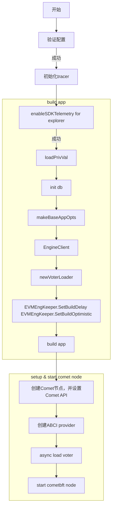

## Halo

从之前的omini 架构图中看出，用户在L2端调用`OmniPortal`  生成xmsg，触发xmsg事件，之后由halo模块进行接受并处理xmsg形成xblock。这部分主要是探究halo模块的工作流程的。

Halo/app/start.go

```go
func Start(ctx context.Context, cfg Config) (<-chan error, func(context.Context) error, error) {}
```



以上就是启动 halo consensus client 的整个流程，涉及到 vote 以及evmengkeeper，创建cmoetbft node（这是整个共识的核心流程。详情请看cometbft的[共识流程]([block-chain-news/cosmos/cometbft/overview.md at main · Marky-Shi/block-chain-news (github.com)](https://github.com/Marky-Shi/block-chain-news/blob/main/cosmos/cometbft/overview.md))）

Halo client中支持evmstaking 以及 validator update 等操作，这是实际上都是通过监听portal.sol 的eth相关的events 然后执行对应的逻辑实现的。

```go
func (p EventProcessor) Deliver(ctx context.Context, _ common.Hash, elog evmenginetypes.EVMEvent) error {
	ethlog, err := elog.ToEthLog()
	if err != nil {
		return err
	}

	switch ethlog.Topics[0] {
	case createValidatorEvent.ID:
		ev, err := p.contract.ParseCreateValidator(ethlog)
		if err != nil {
			return errors.Wrap(err, "parse create validator")
		}

		if err := p.deliverCreateValidator(ctx, ev); err != nil {
			return errors.Wrap(err, "create validator")
		}
	case delegateEvent.ID:
		ev, err := p.contract.ParseDelegate(ethlog)
		if err != nil {
			return errors.Wrap(err, "parse delegate")
		}

		if err := p.deliverDelegate(ctx, ev); err != nil {
			return errors.Wrap(err, "delegate")
		}
	default:
		return errors.New("unknown event")
	}

	return nil
}
```

