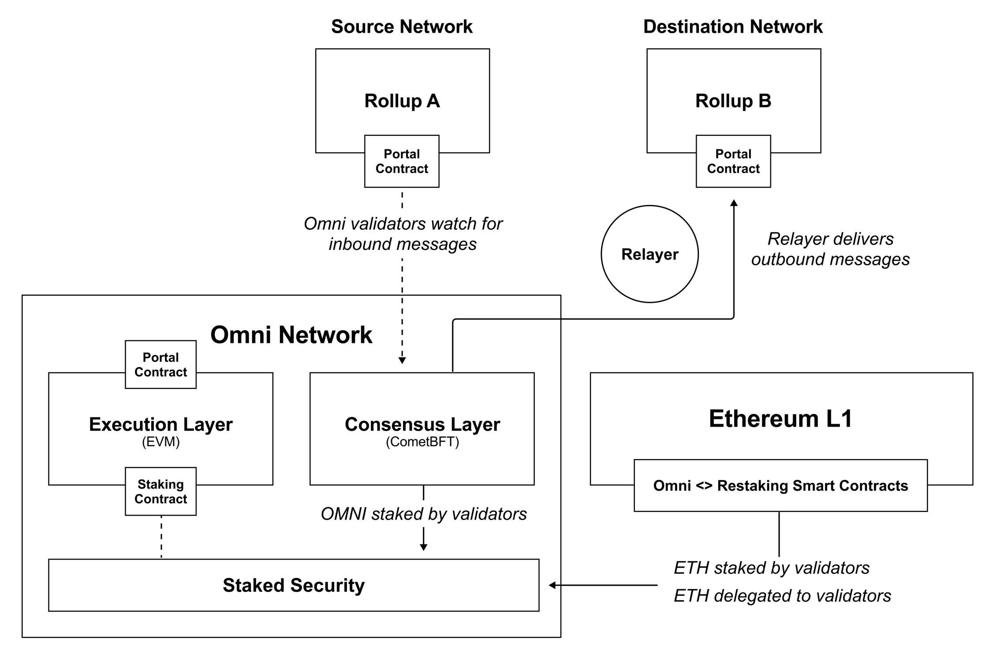
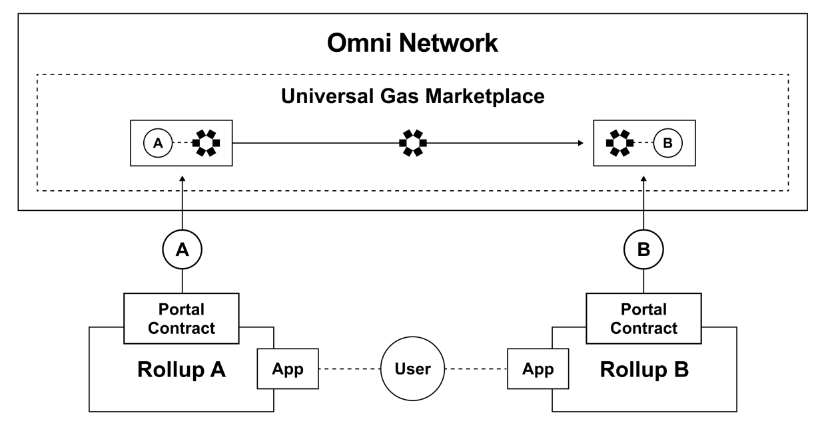
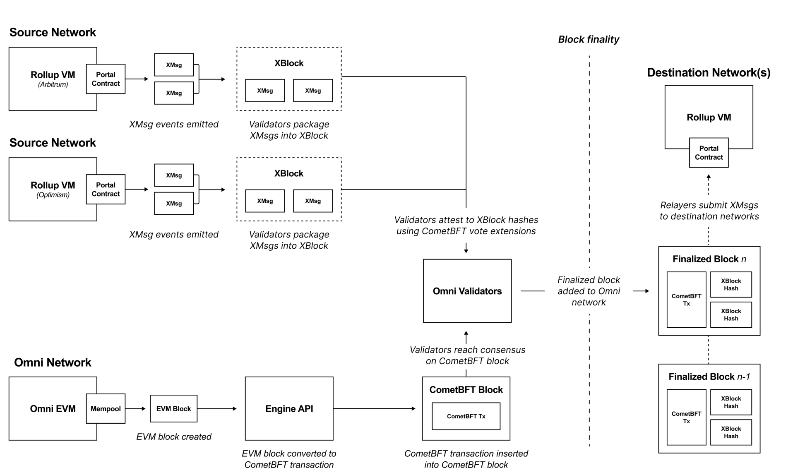
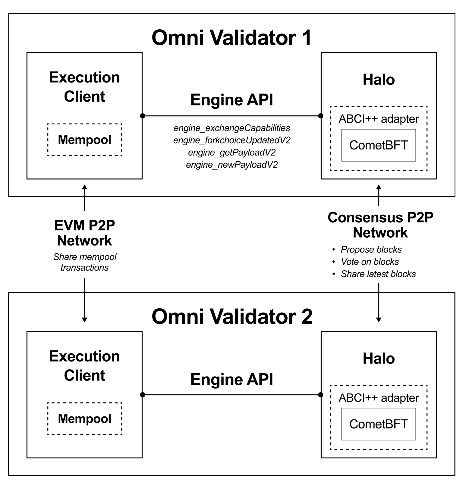

## Omini network

[git](https://github.com/omni-network/omni.git)  跨l2 资产转移协议，基于cosmos-sdk + CometBFT 实现

官网： https://omni.network/

Omini -network 架构概览




资产转移流程


值得一提的是omini 中所使用的gas（包括eth上）都是等比的omini-token




共识执行流程/ 区块产生流程




omini node architecture



Omini-project-tree

```shell
├── contracts: Solidity contracts, bindings, and testing for the Omni protocol.
│ ├── bindings: Go bindings for smart contracts.
│ ├── src: Solidity source files for the protocol's smart contracts.
│ └── test: Tests for smart contracts.
├── docs: Documentation resources, including images and diagrams.
├── explorer: Components for the Omni explorer.
│ ├── db: Database schemas and migrations.
│ ├── graphql: GraphQL API for the explorer.
│ └── ui: User interface for the explorer.
├── halo: The Halo instance, including application logic and attestation mechanisms.
│ ├── app: Application logic for Halo.
│ └── cmd: Command-line tools and utilities.
├── lib: Core libraries for various protocol functionalities.
│ ├── cchain: Consensus chain interaction utilities.
│ └── xchain: Cross-chain messaging and utilities.
├── relayer: Relayer service for cross-chain messages and transactions.
│ └── app: Application logic for the relayer service.
├── scripts: Utility scripts for development and operational tasks.
└── test: Testing suite for end-to-end, smoke, and utility testing.
```

从上述的目录结构来看，使用omini进行跨L2资产转移，首先要和部署在eth上 的 `omini-contracts` 进行交互产生`Xmsg`(omini 中自定义的跨链消息格式，类似于polkadot中的xcm)。在由Hlao模块收集为`XBlock` 经过`cometBFT` 的共识之后，确认资产转移的合法性，然后通过`relayer` 模块，告知 eth上的`omini-contract`  L2_A 完成了资产转移，并在L2_B上构建相应的资产。

换句话说跨链需要用到的模块：

* contracts
* halo
* relayer
* lib 则是负责整个omini共识层以及其他的核心组建。

