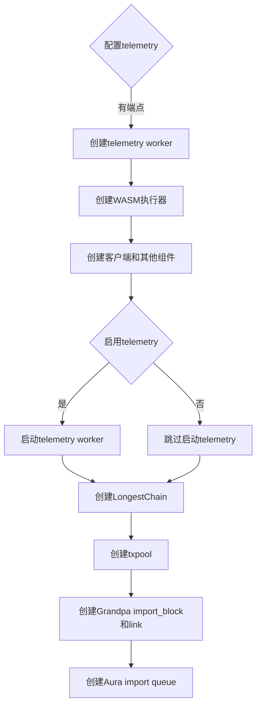
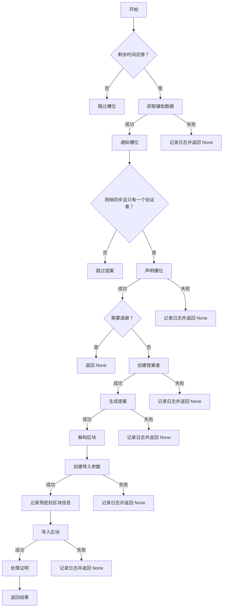
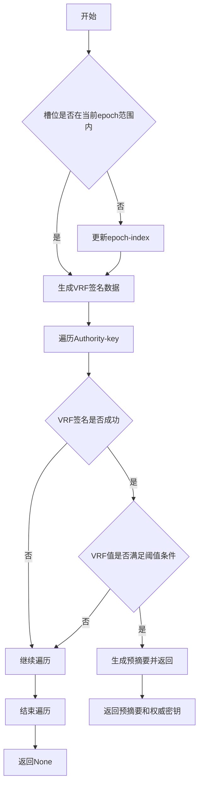
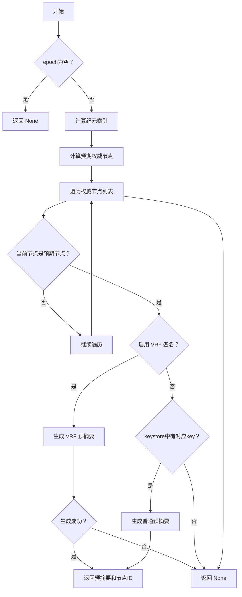

## Aura & Granpa

在substrate 默认的模版中使用的是Aura + grandpa 的组合共识，polkadot-sdk中关于aura 的实现分成两部分（sc-aura |sp-aura）

在node 中对应的代码则是

```rust
// 初始化轻节点配置
pub fn new_partial(config: &Configuration) -> Result<Service, ServiceError> {
  
  ...
  
  Ok(sc_service::PartialComponents {
		client,
		backend,
		task_manager,
		import_queue,
		keystore_container,
		select_chain,
		transaction_pool,
		other: (grandpa_block_import, grandpa_link, telemetry),
	})
}
```




```rust 
pub fn new_full(config: Configuration) -> Result<TaskManager, ServiceError> {
  ... others services
  
  if role.is_authority() {
		let proposer_factory = sc_basic_authorship::ProposerFactory::new(
			task_manager.spawn_handle(),
			client.clone(),
			transaction_pool.clone(),
			prometheus_registry.as_ref(),
			telemetry.as_ref().map(|x| x.handle()),
		);

		let slot_duration = sc_consensus_aura::slot_duration(&*client)?;

		let aura = sc_consensus_aura::start_aura::<AuraPair, _, _, _, _, _, _, _, _, _, _>(
			StartAuraParams {
				slot_duration,
				client,
				select_chain,
				block_import,
				proposer_factory,
				create_inherent_data_providers: move |_, ()| async move {
					let timestamp = sp_timestamp::InherentDataProvider::from_system_time();

					let slot =
			sp_consensus_aura::inherents::InherentDataProvider::from_timestamp_and_slot_duration(
							*timestamp,
							slot_duration,
						);

					Ok((slot, timestamp))
				},
				force_authoring,
				backoff_authoring_blocks,
				keystore: keystore_container.keystore(),
				sync_oracle: sync_service.clone(),
				justification_sync_link: sync_service.clone(),
				block_proposal_slot_portion: SlotProportion::new(2f32 / 3f32),
				max_block_proposal_slot_portion: None,
				telemetry: telemetry.as_ref().map(|x| x.handle()),
				compatibility_mode: Default::default(),
			},
		)?;

		// the AURA authoring task is considered essential, i.e. if it
		// fails we take down the service with it.
		task_manager
			.spawn_essential_handle()
			.spawn_blocking("aura", Some("block-authoring"), aura);
	}

	if enable_grandpa {
		// if the node isn't actively participating in consensus then it doesn't
		// need a keystore, regardless of which protocol we use below.
		let keystore = if role.is_authority() { Some(keystore_container.keystore()) } else { None };

		let grandpa_config = sc_consensus_grandpa::Config {
			// FIXME #1578 make this available through chainspec
			gossip_duration: Duration::from_millis(333),
			justification_generation_period: GRANDPA_JUSTIFICATION_PERIOD,
			name: Some(name),
			observer_enabled: false,
			keystore,
			local_role: role,
			telemetry: telemetry.as_ref().map(|x| x.handle()),
			protocol_name: grandpa_protocol_name,
		};

		// start the full GRANDPA voter
		let grandpa_config = sc_consensus_grandpa::GrandpaParams {
			config: grandpa_config,
			link: grandpa_link,
			network,
			sync: Arc::new(sync_service),
			notification_service: grandpa_notification_service,
			voting_rule: sc_consensus_grandpa::VotingRulesBuilder::default().build(),
			prometheus_registry,
			shared_voter_state: SharedVoterState::empty(),
			telemetry: telemetry.as_ref().map(|x| x.handle()),
			offchain_tx_pool_factory: OffchainTransactionPoolFactory::new(transaction_pool),
		};

		// the GRANDPA voter task is considered infallible, i.e.
		// if it fails we take down the service with it.
		task_manager.spawn_essential_handle().spawn_blocking(
			"grandpa-voter",
			None,
			sc_consensus_grandpa::run_grandpa_voter(grandpa_config)?,
		);
	}
  ...
}
```

可以看到和aura相关的有两个依赖

* sp_consensus_aura 提供了与 Aura 共识机制相关的底层原语。它包含一些基本的数据结构、加密操作相关的函数、以及一些基础的时间戳和插槽（slot）计算相关的工具等
* sc_consensus_aura 侧重于从客户端（client）的角度来实现和管理 Aura 共识机制。它会利用`sp - aura`提供的原语，将 Aura 共识机制集成到 Substrate 客户端的操作流程中。

```rust
//substrate/client/consensus/slots/src/lib.rs 
async fn on_slot(
		&mut self,
		slot_info: SlotInfo<B>,
	) -> Option<SlotResult<B, <Self::Proposer as Proposer<B>>::Proof>>
	where
		Self: Sync,
	{
}
```



On_solt 是aura 共识算法的核心逻辑。基于给定的插槽信息决定是否进行区块提议及后续相关操作（如获取辅助数据、声称插槽、区块创建与导入等）

## BABE

babe 主要是生成一个随机数，然后节点计算的结果低于随机数，则获得出块权，具体的计算逻辑则是在

substrate/client/consensus/babe/src/authorships.rs

```rust
pub fn claim_slot(
	slot: Slot,
	epoch: &Epoch,
	keystore: &KeystorePtr,
) -> Option<(PreDigest, AuthorityId)> {
	let authorities = epoch
		.authorities
		.iter()
		.enumerate()
		.map(|(index, a)| (a.0.clone(), index))
		.collect::<Vec<_>>();
	claim_slot_using_keys(slot, epoch, keystore, &authorities)
}
```


```rust
fn claim_primary_slot(
	slot: Slot,
	epoch: &Epoch,
	c: (u64, u64),
	keystore: &KeystorePtr,
	keys: &[(AuthorityId, usize)],
) -> Option<(PreDigest, AuthorityId)> {
  ...
  
  
  let can_claim = authority_id
				.as_inner_ref()
				.make_bytes::<AUTHORING_SCORE_LENGTH>(
					AUTHORING_SCORE_VRF_CONTEXT,
					&data.as_ref(),
					&vrf_signature.pre_output,
				)
				.map(|bytes| u128::from_le_bytes(bytes) < threshold)
				.unwrap_or_default();
...
}
```

用于在给定的槽位（slot）和纪元（epoch）中确定是否有资格提出区块的次要验证者




```rust
fn claim_secondary_slot(
	slot: Slot,
	epoch: &Epoch,
	keys: &[(AuthorityId, usize)],
	keystore: &KeystorePtr,
	author_secondary_vrf: bool,
) -> Option<(PreDigest, AuthorityId)> {
  
}
```



