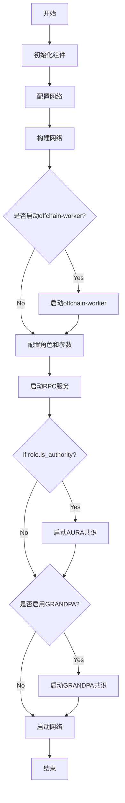

## Substrate-node-template

Git：[polkadot-sdk/templates/solochain at master · paritytech/polkadot-sdk (github.com)](https://github.com/paritytech/polkadot-sdk/tree/master/templates/solochain)

```shell
-rw-r--r--  1 scc  staff   763 12  7 14:27 Dockerfile
-rw-r--r--  1 scc  staff  1210 12  7 14:27 LICENSE
-rw-r--r--  1 scc  staff  9129 12  7 14:27 README.md
drwxr-xr-x  3 scc  staff    96 12  7 14:27 docs
drwxr-xr-x  6 scc  staff   192 12  7 14:27 env-setup
drwxr-xr-x  5 scc  staff   160 12  7 14:27 node
drwxr-xr-x  3 scc  staff    96 12  7 14:27 pallets
drwxr-xr-x  5 scc  staff   160 12  7 14:27 runtime
```

* node： 节点的配置
  * 包括创始文件、账户等各种配置
  * rpc的设置
  * 共识算法的设置等
* docs：开发者文档
* pallets：定义的链端模块
  * 核心逻辑：lib.rs 
  * mock.rs  针对该模块测试环境配置
  * test.rs  测试用例
  * benchmarking.rs  针对该模块的benchmark，用于生成weights.rs 文件（可以理解为eth等其他链中的gas）
  * weight.rs  通过运行benchmarking.rs 代码生成的文件
* runtime：链的运行时配置（pallets需要注册到runtime中才能生效，类似于comos中需要把x/modules 注册到app一样）
  * 这里包含了一些基础模块配置如runtime-benchmark，try-runtime
  * runtime-api设置如 execute_block/apply_extrinsic 等
* Env-setup 则是项目版本，运行脚本配置

值得注意的是，substrate和polkadot 这两个repo，经过前段时间的整合，成为了一个[polkadot-sdk](https://github.com/paritytech/polkadot-sdk)的repo，他们之间的关系就类似于comsos-sdk 和tendermint（cometbft）的关系，区别则在于一个是通过grpc的方式调用，一个则是直接外部引用。

### Node config

```rust
// run full client  path: node/service.rs
pub fn new_full(config: Configuration) -> Result<TaskManager, ServiceError> {}
```



这是全节点的大致流程，值得注意的是substrate提供了很多更换的配置，比如consensus，可以使用babe/pow/pos 更换aura（可以参照polkadot-sdk/substrate/client/consensus/babe 等共识进行配置）。而grandpa 则是选择最优链的算法，这个之后会提到。

### chain spec

node/chain_spec.rs 

```rust
pub fn development_chain_spec() -> Result<ChainSpec, String> {
	Ok(ChainSpec::builder(
		WASM_BINARY.ok_or_else(|| "Development wasm not available".to_string())?,
		None,
	)
	.with_name("Development")
	.with_id("dev")
	.with_chain_type(ChainType::Development)
	.with_genesis_config_preset_name(sp_genesis_builder::DEV_RUNTIME_PRESET)
	.build())
}
```

```rust
/// Builder for creating [`ChainSpec`] instances.
pub struct ChainSpecBuilder<E = NoExtension, EHF = ()> {
	code: Vec<u8>,
	extensions: E,
	name: String,
	id: String,
	chain_type: ChainType,
	genesis_build_action: GenesisBuildAction<EHF>,
	boot_nodes: Option<Vec<MultiaddrWithPeerId>>,
	telemetry_endpoints: Option<TelemetryEndpoints>,
	protocol_id: Option<String>,
	fork_id: Option<String>,
	properties: Option<Properties>,
}
```

`chainspecbuilder` 则是对应链的属性配置，这些属性也是可以配置的，可以参照`development_chain_spec` 方法。

### RPC server

Path: node/rpc.rs

```rust
/// Instantiate all full RPC extensions.
pub fn create_full<C, P>(
	deps: FullDeps<C, P>,
) -> Result<RpcModule<()>, Box<dyn std::error::Error + Send + Sync>>
{
  let mut module = RpcModule::new(());
	let FullDeps { client, pool } = deps;

	module.merge(System::new(client.clone(), pool).into_rpc())?;
	module.merge(TransactionPayment::new(client).into_rpc())?;
  Ok(module)
}
```

 这里只是默认启动pallet-system, transactionpayment 这两个模块的rpc服务，对于自定义的模块rpc服务，也是注册在这个`create_full `中

```rust
pub fn create_full<C, P>(
	deps: FullDeps<C, P>,
) -> Result<RpcModule<()>, Box<dyn std::error::Error + Send + Sync>>
{
  ...
  module.merge(YourRpcTrait::into_rpc(YourRpcStruct::new(ReferenceToClient, ...)))?;
  
  // 对于rpc v2 则是
  let chain_name = chain_spec.name().to_string();
	let genesis_hash = client.block_hash(0).ok().flatten().expect("Genesis block exists; qed");
	let properties = chain_spec.properties();
	module.merge(ChainSpec::new(chain_name, genesis_hash, properties).into_rpc())?;

  Ok(module)
}
```

### pallets

pallets的 开发部分则是可以参照substrate 的开发者文档：

*  [Pallet coupling | Substrate_ Docs](https://docs.substrate.io/build/pallet-coupling/)
* [Custom pallets | Substrate_ Docs](https://docs.substrate.io/build/custom-pallets/)

需要了解的知识除了pallets业务逻辑开发流程之外，还有test cases、benchmarks 的编写以及weights文件的生成

### Runtime

runtime 这里则是链运行时的配置，包括启动模块的顺序，链的基础配置，runtime-api，benchmarks，try-runtime的定制等功能。

```shell
-runtime
	-src 
		- config/mod.rs
		- api.rs
		- benchmarking.rs
		- genesis_config_presets.rs
		- lib.rs
- build.rs	
```

#### runtime version && basics configuration

```rust
#[sp_version::runtime_version]
pub const VERSION: RuntimeVersion = RuntimeVersion {
	spec_name: alloc::borrow::Cow::Borrowed("solochain-template-runtime"),
	impl_name: alloc::borrow::Cow::Borrowed("solochain-template-runtime"),
	authoring_version: 1,
	// The version of the runtime specification. A full node will not attempt to use its native
	//   runtime in substitute for the on-chain Wasm runtime unless all of `spec_name`,
	//   `spec_version`, and `authoring_version` are the same between Wasm and native.
	// This value is set to 100 to notify Polkadot-JS App (https://polkadot.js.org/apps) to use
	//   the compatible custom types.
	spec_version: 100,
	impl_version: 1,
	apis: apis::RUNTIME_API_VERSIONS,
	transaction_version: 1,
	system_version: 1,
};

mod block_times {
  pub const MILLI_SECS_PER_BLOCK: u64 = 6000;
  pub const SLOT_DURATION: u64 = MILLI_SECS_PER_BLOCK;
}

// Time is measured by number of blocks.
pub const MINUTES: BlockNumber = 60_000 / (MILLI_SECS_PER_BLOCK as BlockNumber);
pub const HOURS: BlockNumber = MINUTES * 60;
pub const DAYS: BlockNumber = HOURS * 24;

pub const BLOCK_HASH_COUNT: BlockNumber = 2400;

// Unit = the base number of indivisible units for balances
pub const UNIT: Balance = 1_000_000_000_000;
pub const MILLI_UNIT: Balance = 1_000_000_000;
pub const MICRO_UNIT: Balance = 1_000_000;

/// Existential deposit.
pub const EXISTENTIAL_DEPOSIT: Balance = MILLI_UNIT;
```


#### Runtime pallets registration

```rust
#[frame_support::runtime]
mod runtime {
	#[runtime::runtime]
	#[runtime::derive(
		RuntimeCall,
		RuntimeEvent,
		RuntimeError,
		RuntimeOrigin,
		RuntimeFreezeReason,
		RuntimeHoldReason,
		RuntimeSlashReason,
		RuntimeLockId,
		RuntimeTask
	)]
	pub struct Runtime;

	#[runtime::pallet_index(0)]
	pub type System = frame_system;

	#[runtime::pallet_index(1)]
	pub type Timestamp = pallet_timestamp;

	#[runtime::pallet_index(2)]
	pub type Aura = pallet_aura;

	#[runtime::pallet_index(3)]
	pub type Grandpa = pallet_grandpa;

	#[runtime::pallet_index(4)]
	pub type Balances = pallet_balances;

	#[runtime::pallet_index(5)]
	pub type TransactionPayment = pallet_transaction_payment;

	#[runtime::pallet_index(6)]
	pub type Sudo = pallet_sudo;

	// Include the custom logic from the pallet-template in the runtime.
	#[runtime::pallet_index(7)]
	pub type Template = pallet_template;
}
```

对于这些配置定义在 runtime/src/config/mod.rs 中

#### runtime apis

Runtime/src/apis.rs 定义了runtime api 如一些基础的配置

* core:
  * Executive::execute_block(block)
  * Executive::initialize_block(header)
* Block_builder:
  * Executive::apply_extrinsic(extrinsic)
  * Executive::finalize_block()
  * data.create_extrinsics()
* sp_transaction_pool
  * Executive::validate_transaction(source, tx, block_hash)
* Offchain_worker
  * Executive::offchain_worker(header)
* Consensus_aura
  * pallet_aura::Authorities::<Runtime>::get().into_inner()
  * sp_consensus_aura::SlotDuration::from_millis(Aura::slot_duration())
* sp_consensus_grandpa
  * Grandpa::grandpa_authorities()
* runtime-benchmarks
* try-runtime

这些api也是可以定制的，比如我们使用babe作为共识，则是使用babe的api 替换 aura的api

#### benchmarking

Src/benchmarking.rs

```rust
frame_benchmarking::define_benchmarks!(
	[frame_benchmarking, BaselineBench::<Runtime>]
	[frame_system, SystemBench::<Runtime>]
	[frame_system_extensions, SystemExtensionsBench::<Runtime>]
	[pallet_balances, Balances]
	[pallet_timestamp, Timestamp]
	[pallet_sudo, Sudo]
	[pallet_template, Template]
);
```

这些则是benchmarking 注册到runtime中，对于自定义模块的benchmarking，也是注册到这里

### tip

```rust
/// Return the development genesis config.
pub fn development_config_genesis() -> Value {
	testnet_genesis(
		vec![(
			sp_keyring::Sr25519Keyring::Alice.public().into(),
			sp_keyring::Ed25519Keyring::Alice.public().into(),
		)],
		vec![ //accountid
			Sr25519Keyring::Alice.to_account_id(),
			Sr25519Keyring::Bob.to_account_id(),
			Sr25519Keyring::AliceStash.to_account_id(),
			Sr25519Keyring::BobStash.to_account_id(),
		],
		sp_keyring::Sr25519Keyring::Alice.to_account_id(),
	)
}
```

值得注意的是，在genesis的配置中，账户使用的是sr25519签名算法


